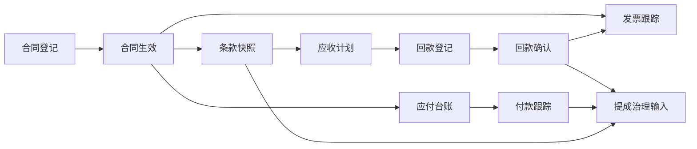

# POMS 合同资金域设计

**文档状态**: Draft (Baseline)
**最后更新**: 2026-03-16
**适用范围**: `POMS` 第一阶段合同资金域中的合同、应收回款、应付付款基础台账与发票管理
**关联文档**:

- 上游设计:
  - `poms-requirements-spec.md`
  - `poms-hld.md`
  - `project-lifecycle-design.md`
- 同级设计:
  - `business-authorization-matrix.md`
  - `workflow-and-approval-design.md`
  - `commission-settlement-design.md`
- 相关 ADR:
  - `../adr/004-contract-finance-domain-module-boundary.md`
  - `../adr/007-phase1-finance-integration-and-recording-boundary.md`

---

## 1. 文档目标

本文档用于在需求说明、HLD 和已接受 ADR 的基础上，正式收敛合同资金域的对象边界、主流程、状态机、关键阻断规则与跨域数据输出，作为后续提成治理、审批流和实现收敛的上游输入。

本文档重点回答：

- 合同资金域第一阶段到底包含哪些对象，哪些不包含
- 合同、回款、应付付款、发票之间如何建立稳定关系
- 哪些记录属于业务登记与确认，哪些不应被误建模成完整财务闭环
- 哪些事实是提成计算、重算和项目经营视图的稳定输入
- 哪些动作需要确认、审批、冲销或版本替代，而不是直接覆盖

---

## 2. 当前阶段定位

当前文档处于：

**“合同资金域第一份详细设计基线，先固定合同、回款、成本和发票台账的对象边界与生效口径，再为提成治理和审批流设计提供稳定输入。”**

这意味着：

- 本文档聚焦第一阶段基础闭环，不扩展成完整 ERP 或财务系统设计
- 本文档优先收敛事实源、生效口径、状态机与联动规则
- 本文档不承诺第一阶段就实现银行流水对接、完整付款审批流或完整开票申请流

---

## 3. 上游约束

本设计继承以下已固定结论：

- 后端第一阶段独立拆出 `contract-finance` 模块
- 第一阶段以业务登记与确认为主，财务强联动后置
- `Project` 是销售流程域主对象，合同资金域不接管销售主状态机
- 合同台账建立必须在签约完成之后，且是进入收付款与发票跟踪的前置条件
- 回款第一阶段以系统内录入并经财务确认生效为准，同时预留后续外部同步能力
- 应付与付款第一阶段只做基础台账，服务成本沉淀、毛利核算与项目经营视图
- 发票第一阶段只做台账与状态管理，不先建完整开票申请流
- 提成治理域不直接维护合同、回款、成本和发票事实，而是消费本域生效数据

---

## 4. 设计原则

- **事实归属清晰**: 合同、回款、成本、发票的生效事实统一归合同资金域维护
- **业务登记优先于财务联动**: 第一阶段先保证登记、确认、冲销、版本替代链路完整，不追求真实财务付款闭环
- **生效口径显式化**: 合同生效、回款确认、成本纳入口径、发票状态变化都必须有可审计的明确节点
- **版本替代优于直接覆盖**: 合同变更、回款冲销、成本调整、发票异常解除等都应通过新增记录或状态迁移处理
- **跨域依赖单向化**: 销售流程域为合同前置输入，合同资金域向提成治理域输出稳定事实，避免循环改写
- **查询联动建立在稳定对象之上**: 联动视图应消费对象事实，而不是靠临时拼接字段凑状态

---

## 5. 域边界与对象清单

### 5.1 第一阶段包含的核心对象

- `Contract`
- `ContractTermSnapshot`
- `ContractAmendment`
- `ReceivablePlan`
- `ReceiptRecord`
- `PayableRecord`
- `PaymentRecord`
- `InvoiceRecord`

### 5.2 第一阶段不在本域内强行扩展的内容

- 银行流水自动同步与自动认领
- 完整付款审批流
- 完整开票申请与开票审批工作流
- 财务总账、凭证、科目或税务申报能力
- 多系统对账引擎

### 5.3 对象职责口径

#### `Contract`

- 承载项目签约后的合同主体事实
- 记录合同编号、客户、项目、签约日期、金额、税率、付款条款、履约状态等主信息
- 表达合同当前生命周期状态，但不直接替代条款快照与补充协议版本历史

#### `ContractTermSnapshot`

- 承载合同在某次生效口径下的关键条款快照
- 用于冻结金额、税率、付款节点、质保金、首付款比例等跨域计算字段
- 作为提成计算、回款计划初始化和后续审计回溯的稳定依据

#### `ContractAmendment`

- 承载补充协议、关键条款变更和合同变更申请结果
- 不直接覆盖原合同事实，而是驱动生成新的有效条款快照

#### `ReceivablePlan`

- 承载基于有效合同条款拆解出的应收计划
- 记录计划节点、计划金额、计划日期、质保金属性、完成情况与逾期状态
- 是待收款跟踪和回款进度判断的基础对象

#### `ReceiptRecord`

- 承载实际到账记录
- 第一阶段允许 `manual` 数据来源，并保留未来 `external_sync` 扩展能力
- 只有经财务确认后的记录才进入生效回款口径

#### `PayableRecord`

- 承载成本侧应付基础台账
- 用于记录供应商、成本类别、应付金额、预计支付时间和项目归属
- 第一阶段主要服务成本沉淀、毛利核算和经营视图，不进入完整审批闭环

#### `PaymentRecord`

- 承载成本侧付款跟踪记录
- 记录支付时间、支付金额、对应应付项和备注
- 第一阶段是基础跟踪对象，不等于财务真实付款审批对象

#### `InvoiceRecord`

- 承载发票台账与状态跟踪
- 记录开票、收票、验票、异常和关闭等状态
- 与合同、回款、项目建立联动查询关系，但不替代完整发票申请流

---

## 6. 对象关系

第一阶段建议固定以下关系：

- 一个 `Project` 可关联多个 `Contract`
- 一个 `Contract` 可关联多个 `ContractAmendment`
- 一个 `Contract` 在任一时点只有一个当前有效 `ContractTermSnapshot`
- 一个当前有效 `ContractTermSnapshot` 可初始化多条 `ReceivablePlan`
- 一个 `Contract` 可关联多条 `ReceiptRecord`
- 一个 `Project` 可关联多条 `PayableRecord` 与 `PaymentRecord`
- 一个 `Contract` 与 `Project` 可关联多条 `InvoiceRecord`

说明：

- 第一阶段的成本跟踪以项目维度为主，不强制要求每条成本都必须绑定某份具体合同
- 但若能关联到合同，应保留 `contractId` 引用，方便后续经营分析与审计

---

## 7. 合同资金主流程

### 7.1 第一阶段主流程

1. 签约完成
2. 合同登记与审核
3. 合同生效并生成当前有效 `ContractTermSnapshot`
4. 初始化 `ReceivablePlan`
5. 持续登记 `ReceiptRecord`
6. 财务确认回款生效
7. 登记 `PayableRecord` / `PaymentRecord`
8. 跟踪 `InvoiceRecord` 状态
9. 向提成治理和经营视图输出生效事实

### 7.2 主流程关系图

---

## 8. 生命周期与状态机

### 8.1 `Contract`

- 状态：草稿、待审核、已生效、履约中、已变更、已终止、已完成
- 关键动作：登记、提交审核、生效、登记补充协议、终止、完成
- 回退规则：已生效后不得直接覆盖关键字段，必须通过 `ContractAmendment` 形成新快照

### 8.2 `ReceivablePlan`

- 状态：草稿、已生效、部分完成、已完成、已逾期、已关闭
- 关键动作：初始化、确认生效、标记完成、标记逾期、关闭
- 回退规则：计划调整应保留历史版本、调整原因和调整时间

### 8.3 `ReceiptRecord`

- 状态：草稿、待确认、已确认、已冲销、已作废
- 关键动作：登记到账、财务确认、冲销、作废
- 回退规则：已确认回款不可直接删除，只能通过冲销和调整记录处理

### 8.4 `PayableRecord`

- 状态：草稿、已登记、部分支付、已完成、已关闭、已作废
- 关键动作：登记、更新金额、标记部分支付、完成、关闭、作废
- 回退规则：已纳入毛利计算的记录不得直接删除，应通过调整记录修正

### 8.5 `PaymentRecord`

- 状态：草稿、已登记、已确认、已作废
- 关键动作：登记付款、确认、作废
- 回退规则：已确认付款不可直接删除，应留痕作废原因或冲回关系

### 8.6 `InvoiceRecord`

- 状态：草稿、待开票、已开票、已收票、已验票、异常、已关闭
- 关键动作：登记、更新状态、标记异常、解除异常、关闭
- 回退规则：异常解除必须保留异常说明、处理结论和责任人

---

## 9. 生效口径与可信源

第一阶段建议固定以下可信源规则：

| 业务事实     | 当前可信源                        | 生效口径                     |
| ------------ | --------------------------------- | ---------------------------- |
| 合同主体信息 | `Contract`                        | 已生效合同为当前主体事实     |
| 合同关键条款 | `ContractTermSnapshot`            | 当前有效快照为跨域计算口径   |
| 合同变更     | `ContractAmendment`               | 经接受的变更驱动新快照替代   |
| 应收计划     | `ReceivablePlan`                  | 已生效计划作为待收款跟踪依据 |
| 实际回款     | `ReceiptRecord`                   | 已确认记录才作为生效回款事实 |
| 成本口径     | `PayableRecord` / `PaymentRecord` | 按不含税口径进入毛利核算     |
| 发票状态     | `InvoiceRecord`                   | 当前最新有效状态为展示口径   |

说明：

- 提成治理域消费的是“已生效合同快照 + 已确认回款 + 生效成本口径”，不是任意草稿记录
- 项目经营视图可展示草稿和待确认记录，但必须与生效口径区分

---

## 10. 关键阻断规则

第一阶段至少固定以下阻断规则：

1. 未完成签约登记，不得建立有效合同台账。
2. 合同未生效，不得初始化正式 `ReceivablePlan`。
3. 未形成有效合同台账，不得进入正式收付款与发票跟踪。
4. 未经财务确认的 `ReceiptRecord` 不得进入提成计算生效口径。
5. 已确认回款不得直接删除，只能冲销。
6. 已生效合同关键条款不得直接改写，只能通过补充协议或变更形成新快照。
7. 已纳入毛利计算的成本记录不得静默删除或重写。
8. 发票异常解除必须留痕，不得直接把异常状态覆盖成正常状态。

---

## 11. 关键里程碑

第一阶段建议将以下事实视为合同资金域关键里程碑：

- `contract-created`
- `contract-approved`
- `contract-effective`
- `contract-snapshot-effective`
- `receivable-plan-initialized`
- `receipt-confirmed`
- `payable-recorded`
- `invoice-issued`
- `invoice-closed`

这些事实应可审计、可追溯、不可由普通编辑直接覆盖。

---

## 12. 建议关键字段

### 12.1 `Contract`

- `id`
- `projectId`
- `contractCode`
- `customerName`
- `signDate`
- `status`
- `currentSnapshotId`
- `effectiveAt`

### 12.2 `ContractTermSnapshot`

- `id`
- `contractId`
- `version`
- `amountTaxInclusive`
- `amountTaxExclusive`
- `taxRate`
- `downPaymentRate`
- `retentionRate`
- `paymentTerms`
- `effectiveAt`

### 12.3 `ReceiptRecord`

- `id`
- `contractId`
- `projectId`
- `receivablePlanId`
- `sourceType`
- `receiptAmount`
- `receiptDate`
- `confirmedAt`
- `confirmedBy`
- `status`

### 12.4 `PayableRecord` / `PaymentRecord`

- `id`
- `projectId`
- `contractId`
- `vendorName`
- `costCategory`
- `amountTaxExclusive`
- `status`
- `paidAmount`
- `paymentDate`

### 12.5 `InvoiceRecord`

- `id`
- `projectId`
- `contractId`
- `invoiceType`
- `invoiceNumber`
- `invoiceAmount`
- `invoiceDate`
- `status`
- `exceptionReason`

### 12.6 与授权矩阵对齐的字段包建议

为与 `business-authorization-matrix.md` 保持一致，合同资金域第一阶段建议把关键字段继续抽象为以下字段包：

- `Contract` 合同金额包：`amountTaxInclusive`、`amountTaxExclusive`、`taxRate`
- `Contract` 付款条件包：`paymentTerms`、`downPaymentRate`、`retentionRate`
- `Contract` 合同标识包：`contractCode`、`customerName`、`signDate`
- `ReceivablePlan` 应收计划包：计划节点、计划金额、计划日期、质保金节点标识
- `ReceiptRecord` 到账事实包：`receiptAmount`、`receiptDate`、`sourceType`
- `ReceiptRecord` 确认结论包：`confirmedAt`、`confirmedBy`、`status`、冲销原因
- `PaymentRecord` 付款事实包：`paidAmount`、`paymentDate`、`status`
- `InvoiceRecord` 发票状态包：`invoiceType`、`invoiceNumber`、`invoiceAmount`、`invoiceDate`、`status`
- `InvoiceRecord` 异常处理包：`exceptionReason`、异常处理结论、关闭时间

说明：

- 上述字段包中，合同金额包、付款条件包、到账事实包、确认结论包属于高敏字段包。
- 高敏字段包不得通过普通更新接口直接生效，应通过审核、生效、确认、冲销、关闭等命令型动作进入有效口径。

---

## 13. 跨域输出

### 13.1 对销售流程域的输出

- 合同是否已形成有效台账
- 项目是否可进入收付款与发票跟踪语义
- 项目经营视图所需的合同、回款、成本和发票汇总信息

### 13.2 对提成治理域的输出

- 当前有效合同条款快照
- 已确认回款记录与累计回款比例
- 已纳入口径的成本记录
- 合同变更、回款冲销、成本变化等重算触发事实

### 13.3 对审批流设计的输出

- `Contract` 提交审核：放行方式 = `审批`
- `Contract` 生效：放行方式 = `审批/确认`
- `ReceiptRecord` 财务确认：放行方式 = `确认`
- `ReceiptRecord` 冲销 / 作废：放行方式 = `审批/确认`
- `PaymentRecord` 确认生效：放行方式 = `确认`
- `InvoiceRecord` 标记异常 / 解除异常：放行方式 = `审批/确认`
- `ContractAmendment` 生效新快照：放行方式 = `审批`

### 13.4 对业务授权矩阵的输出

本文档至少输出以下第一批稳定对象动作：

- 登记合同草稿
- 提交合同审核
- 确认合同生效
- 登记补充协议 / 合同变更
- 初始化应收计划
- 登记到账记录
- 确认回款生效
- 冲销回款记录
- 登记应付台账
- 登记付款跟踪
- 确认付款生效
- 维护发票状态
- 标记发票异常 / 解除异常
- 关闭发票记录

### 13.5 与矩阵口径对齐的补充约束

- 合同金额、税率、付款条款、首付款比例等属于 `高` 敏感字段，不得由普通登记动作直接生效
- 回款确认、付款确认、发票异常处理与关闭动作统一受财务归口组织限制
- 作废、冲销、关闭类动作不属于普通编辑，必须独立留痕并按矩阵中的高敏感动作处理
- 普通更新接口只允许维护草稿态字段或中敏感字段包，高敏字段包应通过命令型动作接口处理

---

## 14. 测试与验收要点

第一阶段至少覆盖以下场景：

- 合同未生效不得初始化正式应收计划
- 未形成有效合同台账不得登记正式回款和发票
- 回款确认后才能进入提成生效口径
- 已确认回款只能冲销，不能直接删除
- 合同补充协议生效后必须生成新的有效条款快照
- 成本变化可进入毛利核算并形成后续重算候选
- 发票异常必须留痕并可追溯处理结论
- 合同、回款、成本、发票能够按项目维度联动查询

---

## 15. 当前仍待后续细化的问题

- 一个 `Project` 是否允许并行存在多份同时履约的有效合同，以及其经营视图汇总口径
- `ReceivablePlan` 是否需要进一步细分为首付款、阶段款、尾款、质保金等固定计划类型字典
- `PayableRecord` 与 `PaymentRecord` 是否需要在后续阶段引入更正式的审批闭环
- 发票台账是否需要区分销项发票与进项发票的更细生命周期
- 回款外部同步接入后，`manual` 与 `external_sync` 的冲突裁决规则如何定义

---

## 16. 当前结论

本首版文档已经足以作为合同资金域详细设计基线。当前最重要的动作不是继续扩写合同资金专题，而是以“合同生效、回款确认、成本纳入口径、发票状态跟踪”这四类生效事实为中心，完成跨文档收口并进入正式评审；待评审结论稳定后，再把接口命令、状态迁移和数据模型口径冻结下来。
