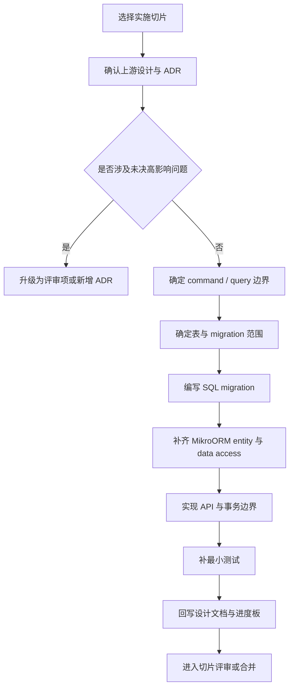
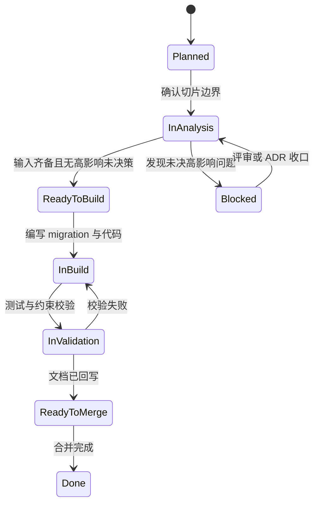

# POMS 实施启动与交付流程说明

**文档状态**: Active
**最后更新**: 2026-03-22
**适用范围**: `POMS` 第一阶段从详细设计进入工程接入、migration 编写与首批模块落地的实施协作约束
**关联文档**:

- 上游设计:
  - `poms-design-progress.md`
  - `poms-hld.md`
  - `design-review-follow-up-summary.md`
- 同级设计:
  - `interface-command-design.md`
  - `interface-openapi-dto-design.md`
  - `query-view-boundary-design.md`
  - `data-model-prerequisites.md`
  - `table-structure-freeze-design.md`
  - `schema-ddl-design.md`
- 相关 ADR:
  - `../adr/012-data-persistence-technology-selection.md`

---

## 1. 文档目标

本文档不是新的业务设计文档，而是面向实施者的统一入口，重点回答以下问题：

- 当前阶段哪些设计结论已经足够稳定，可以直接进入实现
- 进入实现前，实施者应按什么顺序阅读现有文档
- 一个标准开发切片应包含哪些输入、输出与回写动作
- 哪些事项属于可直接实现，哪些事项必须升级为评审或 ADR 决策

本文档的目标是减少“看过很多文档但不知道先做什么”的协作摩擦。

---

## 2. 当前实施判断

截至当前，`POMS` 已满足“受控进入实施阶段”的条件。

原因不是所有设计文档都已经进入 `Accepted`，而是：

- `poms-requirements-spec.md` 与 `poms-hld.md` 已是 `Accepted`
- `ADR-001` 到 `ADR-012` 已固定关键高影响决策
- 多份详细设计虽仍为 `Draft (Baseline)`，但已明确标注“可作为下游输入”
- 首轮正式评审结论为 `Passed with follow-up`，剩余 follow-up 主要是细化项，不是当前实施阻塞项
- 数据持久层路线已固定为 `PostgreSQL + SQL-first migration + MikroORM`

因此，当前推荐的推进方式不是继续扩写新的专题设计，而是按切片进入工程接入、迁移脚本与首批模块实现。

---

## 3. 实施者阅读顺序

若是第一次接手 `POMS` 第一阶段实施，建议按以下顺序阅读：

1. `poms-design-progress.md`，先理解当前阶段、状态源与哪些文档可直接作为下游输入。
2. `../adr/012-data-persistence-technology-selection.md`，确认持久层路线与工程约束。
3. `poms-hld.md`，确认模块边界、系统可信源与整体架构。
4. 与当前切片直接相关的业务域设计文档，例如项目、合同资金、提成或审批设计。
5. `interface-command-design.md` 与 `interface-openapi-dto-design.md`，确认写侧动作和接口合同边界。
6. `query-view-boundary-design.md`，确认列表、详情、看板和待办等读侧边界。
7. `data-model-prerequisites.md`、`table-structure-freeze-design.md`、`schema-ddl-design.md`，确认落表、迁移与约束实现方式。
8. `design-review-follow-up-summary.md`，确认哪些议题只是 follow-up，不应在当前切片内擅自放大。

如果是参与平台治理域相关切片，应在第 4 步后补读 `platform-governance/` 下对应子设计。

---

## 4. 当前建议的实施顺序

第一阶段不建议“先建一堆 entity 再回头补 SQL”；推荐顺序如下：

1. 先完成 `MikroORM` 基础工程接入与基础配置。
2. 再建立 migration 目录、命名规则与执行方式。
3. 然后按业务切片编写真实 SQL migration，优先落核心主表、关键关系与高频索引。
4. 在 migration 基础上补齐 entity、repository / data-access 与事务边界封装。
5. 再实现 command API、query API 与必要的 DTO / view model。
6. 最后补齐最小可验证测试，并回写设计文档与进度板。

当前更适合优先启动的切片：

1. 持久层基础设施切片：`MikroORM` 配置、migration 组织、事务边界约定。
2. `Project` 主对象核心表切片：主表、状态字段、关键唯一约束、动作记录骨架。
3. 合同资金域首批表切片：合同、回款记录、基础台账关系。
4. 审批支撑切片：审批实例、审批记录、统一待办所需最小支撑表。

---

## 5. 标准开发切片

每个切片建议按统一结构推进，避免有人只写表、有人只写接口、有人只改文档。

### 5.1 切片输入

一个切片开始前，至少应明确：

- 对应业务对象或横切能力的边界
- 关联 ADR 与上游设计结论
- 需要实现的 command 或 query 边界
- 对应的数据表、约束、索引与事务范围
- 本切片是否涉及高敏感状态变迁或审批联动

### 5.2 切片输出

一个切片完成时，通常至少应产出：

- migration SQL
- `MikroORM` entity 或映射定义
- repository / data-access 代码
- command API 或 query API
- 必要的 DTO、view model 或 contract 代码
- 最小可验证测试
- 文档回写记录

### 5.3 切片完成定义

满足以下条件，才建议视为“切片完成”：

1. 数据结构已通过真实 migration 落地，而不是只停留在 entity 定义。
2. 主外键、唯一约束、索引与空值策略已实现，而不是只在文档中声明。
3. API 行为与接口文档边界一致，没有把命令型动作退化成普通更新接口。
4. 涉及状态迁移时，业务状态与审批状态没有混用。
5. 至少有最小级别的自动化验证，覆盖核心成功路径和关键约束失败路径。
6. 相关设计文档、进度板或 ADR 引用已同步回写。

---

## 6. 实施流程图

这个流程强调两件事：

- 先确认边界，再动代码
- 先落实真实数据结构，再补应用层映射

---

## 7. 切片状态图

推荐把每个切片显式维护在上述状态之一，避免“代码写了一半但大家都以为已经完成”。

---

## 8. 哪些变更可以直接做，哪些必须升级

### 8.1 可以直接在切片内实现的事项

- 已被现有设计文档明确覆盖的字段、表、索引、接口与状态约束
- 不改变现有业务边界的命名修正、代码组织优化与实现细化
- 为落地现有文档而补充的测试、脚手架与工程配置

### 8.2 必须升级为评审或 ADR 的事项

- 改变业务对象边界、模块边界或可信源归属
- 改变命令型动作与普通更新接口的边界
- 改变主外键策略、唯一约束原则或高频索引策略
- 改变 `PostgreSQL + SQL-first migration + MikroORM` 这一路线本身
- 让 follow-up 细化议题反向推翻已通过评审的主结论

简单判断原则是：如果这项变更会让多个文档同时失效，它通常不应在单个开发切片里静默处理。

---

## 9. 文档回写规则

实施阶段不是“设计冻结后不再更新文档”，而是要把实现反馈控制在正确位置回写。

推荐回写规则如下：

1. 如果只是把已有设计落实为代码，更新 `poms-design-progress.md` 的阶段描述与下一步建议即可。
2. 如果 SQL 实现暴露了字段命名、约束粒度或索引策略需要细化，应优先回写 `schema-ddl-design.md`。
3. 如果实现发现 logical table 职责边界不清，应回写 `table-structure-freeze-design.md` 或 `data-model-prerequisites.md`。
4. 如果实现推翻了既有高影响结论，不应直接改写旧文档，而应新增 ADR 或评审摘要。

---

## 10. 当前协作约束

为控制第一阶段返工，当前建议所有实施者遵守以下约束：

1. 不绕过 migration 直接依赖 ORM 自动建表作为权威结构来源。
2. 不把高敏感动作合并进普通更新接口。
3. 不在未确认读侧边界前提前扩张列表字段与聚合口径。
4. 不在单个切片内同时重写多个域的边界。
5. 不把仍属 follow-up 的高级场景提前做成第一阶段默认能力。

---

## 11. 当前建议的下一步

若按当前成熟度继续推进，最合适的直接下一步已不再是继续扩大第二阶段议题，而是先补齐第一阶段未完成承诺：

1. 启动平台治理域补齐切片，优先完成 `OrgUnit`、`Role`、`User` 与关系模型的真实持久化落地。
2. 在平台主数据真实化后，补齐平台导航治理闭环，使导航与真实角色/权限、真实路由和受控维护机制一致。
3. 按 `CommissionRuleVersion -> CommissionRoleAssignment -> CommissionCalculation -> CommissionPayout -> CommissionAdjustment` 顺序启动提成治理域实现。
4. 每完成一个补齐切片，就把结果回写到 `poms-design-progress.md`、`poms-phase1-delivery-roadmap.md` 与对应业务域设计文档。

本文档后续若继续维护，应重点跟随“第一阶段缺口是否被按切片稳定补齐”演进，而不是提前扩写新的第二阶段业务规则。
