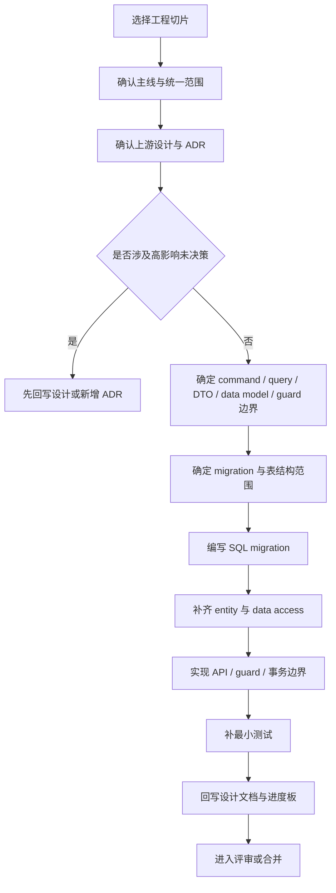

# POMS 实施启动与交付流程说明

**文档状态**: Active
**最后更新**: 2026-04-04
**适用范围**: `POMS` 第二阶段当前统一开发范围下的工程实施、切片推进与文档回写约束
**关联文档**:

- 上游设计:
  - `poms-design-progress.md`
  - `poms-hld.md`
  - `phase2-mainline-delivery-plan.md`
  - `phase2-lx-t04-full-mainline-development-decision.md`
  - `phase2-detailed-design-index-map.md`
- 同级设计:
  - `interface-command-design.md`
  - `interface-openapi-dto-design.md`
  - `query-view-boundary-design.md`
  - `data-model-prerequisites.md`
  - `table-structure-freeze-design.md`
  - `schema-ddl-design.md`
- 历史回溯:
  - `archive/control-history/phase2-mainline-delivery-plan.md`
  - `archive/control-history/phase2-lx-t04-full-mainline-development-decision.md`
- 相关 ADR:
  - `../adr/012-data-persistence-technology-selection.md`

---

## 1. 文档目标

本文档是当前工程实施入口，不再承担历史论证职责。

它只回答五个问题：

- 当前为什么可以进入实现
- 进入实现前应按什么顺序阅读文档
- 一个标准工程切片应包含哪些输入和输出
- 哪些变更可以直接做，哪些必须先升级为设计回写或 ADR
- 实现完成后应如何回写文档与进度板

如果需要回溯为什么形成当前口径，统一回看 `archive/control-history/` 下的长文版本。

---

## 2. 当前实施判断

截至 2026-04-04，`POMS` 当前已满足第二阶段统一开发范围下的实施条件。

原因不是所有设计文档都进入了 `Accepted`，而是：

- `phase2-mainline-delivery-plan.md` 已固定当前主线目标、当前阶段口径与工程进入顺序
- `phase2-lx-t04-full-mainline-development-decision.md` 已给出 Go 结论、统一开发范围、统一切片顺序与启动约束
- `phase2-detailed-design-index-map.md` 已形成当前正式导航入口
- 当前范围内的主线设计已下钻到 `command -> query -> DTO -> data model -> table freeze -> schema / DDL -> guard`
- 历史审阅、批次收口、主线完成轨迹与长篇论证已经归档，不再与当前实施入口混放

因此，当前推荐的推进方式不是继续扩写过程文档，而是按统一范围进入工程切片实施，并持续回写设计文档与进度板。

---

## 3. 实施者阅读顺序

如果是第一次接手当前第二阶段实现，建议按以下顺序阅读：

1. `README.md`，先确认当前正式输入集合。
2. `poms-design-progress.md`，确认当前阶段判断、当前入口与当前风险。
3. `phase2-lx-t04-full-mainline-development-decision.md`，确认当前统一开发范围、切片顺序与工程约束。
4. `phase2-mainline-delivery-plan.md`，确认当前主线目标、阅读路径与工程进入顺序。
5. `phase2-detailed-design-index-map.md`，定位当前切片所属主线与关联专题。
6. 与当前切片直接相关的业务主文档。
7. `interface-command-design.md`、`interface-openapi-dto-design.md`、`query-view-boundary-design.md`，确认实现边界。
8. `data-model-prerequisites.md`、`table-structure-freeze-design.md`、`schema-ddl-design.md`，确认持久化与约束实现方式。

如果当前切片涉及历史争议、批次收口或长篇论证，再补读 `archive/control-history/`、`archive/mainline-closure/` 或 `archive/phase2-batches/`，但这些文档不应反向替代当前正式入口。

---

## 4. 当前统一工程顺序

当前工程切片顺序固定为：

1. 平台治理补齐切片：`OrgUnit -> Role -> User -> 授权关系 -> 导航治理闭环`
2. `L1 + L2` 可信源与快照基础切片
3. `L3` 收口链切片
4. 提成治理主机制切片：`CommissionRuleVersion -> CommissionRoleAssignment -> CommissionCalculation -> CommissionPayout -> CommissionAdjustment`
5. `L4 + L5` 联动切片
6. 已显式后置的表达增强与未来扩展，待主链稳定后再独立排期

当前不允许回退到旧的“局部首批排期”叙事，也不允许从历史批次文档中重新抽取另一套实施顺序。

---

## 5. 标准开发切片

每个切片建议按统一结构推进，避免有人只改表、有人只改接口、有人只改文档。

### 5.1 切片输入

一个切片开始前，至少应明确：

- 当前切片属于哪条主线
- 该切片在统一工程顺序中的位置
- 对应业务对象或横切能力的边界
- 关联 ADR 与上游设计结论
- 需要实现的 `command` / `query` / `DTO` / `data model` / `guard` 边界
- 本切片是否触及敏感字段、审批公共链或跨主线承接点

### 5.2 切片输出

一个切片完成时，通常至少应产出：

- migration SQL
- entity / mapping 定义
- repository / data-access 代码
- command API 或 query API
- 必要的 DTO、view model 或 contract 代码
- 最小自动化验证
- 文档回写记录

### 5.3 切片完成定义

满足以下条件，才建议视为“切片完成”：

1. 数据结构已通过真实 migration 落地，而不是只停留在 entity 定义。
2. 主外键、唯一约束、索引与空值策略已实现，而不是只写在文档里。
3. API 行为与设计边界一致，没有把命令型动作退化成普通更新接口。
4. 相关 `guard`、敏感可见性或审批公共链没有在实现中被静默绕开。
5. 至少有最小自动化验证，覆盖核心成功路径和关键约束失败路径。
6. 相关设计文档与 `poms-design-progress.md` 已同步回写。

---

## 6. 实施流程

这个流程强调三件事：

- 先确认边界，再动代码
- 先落实真实数据结构，再补应用层映射
- 先回写当前入口，再考虑历史留痕

---

## 7. 哪些变更可以直接做，哪些必须升级

### 7.1 可以直接在切片内实现的事项

- 已被当前设计文档明确覆盖的字段、表、索引、接口与状态约束
- 不改变现有主线边界的命名修正、代码组织优化与实现细化
- 为落地现有设计而补充的测试、脚手架与工程配置

### 7.2 必须先升级为设计回写或 ADR 的事项

- 改变主对象、可信源、模块边界或跨主线承接关系
- 改变命令型动作与普通更新接口的边界
- 改变主外键策略、唯一约束原则或高频索引策略
- 改变 `PostgreSQL + SQL-first migration + MikroORM` 路线本身
- 把已显式后置的未来扩展混入当前统一开发承诺

简单判断原则是：如果这项变更会让多个当前入口文档同时失效，它就不应在单个开发切片里静默处理。

---

## 8. 文档回写规则

实施阶段不是“设计冻结后不再更新文档”，而是要把实现反馈回写到正确位置。

推荐回写规则如下：

1. 若只是推进当前统一范围内的工程切片，先更新 `poms-design-progress.md`。
2. 若是主线顺序、当前阶段口径或默认阅读路径发生变化，更新 `phase2-mainline-delivery-plan.md`。
3. 若是统一开发范围、工程顺序或工程约束发生变化，更新 `phase2-lx-t04-full-mainline-development-decision.md`。
4. 若是主线导航、专题索引或阅读路径发生变化，更新 `phase2-detailed-design-index-map.md`。
5. 若是表结构、约束或字段边界需要细化，优先回写 `schema-ddl-design.md`、`table-structure-freeze-design.md` 或 `data-model-prerequisites.md`。
6. 若实现推翻了高影响结论，不应直接改写旧文档，而应先新增 ADR 或补设计判断。

---

## 9. 当前协作约束

为控制返工，当前建议所有实施者遵守以下约束：

1. 不绕过 migration 直接依赖 ORM 自动建表作为权威结构来源。
2. 不把高敏感动作合并进普通更新接口。
3. 不在未确认读侧边界前提前扩张列表字段与聚合口径。
4. 不在单个切片内同时重写多个域的边界。
5. 不把已显式后置的范围顺手做成当前默认能力。
6. 不把历史批次、历史评审或历史长文重新抬回根目录充当当前入口。

---

## 10. 当前建议的下一步

如果按当前成熟度推进，下一步最合适的是：

1. 按 `phase2-lx-t04-full-mainline-development-decision.md` 固定的统一开发范围推进工程切片。
2. 按 `phase2-mainline-delivery-plan.md`、`phase2-detailed-design-index-map.md` 与本文档的分工进入实现。
3. 每个切片都按 `command -> query -> DTO -> data model -> table freeze -> schema / DDL -> guard -> tests -> docs writeback` 闭环推进。
4. 若需要回溯历史论证、批次收口和主线完成轨迹，统一进入 `archive/control-history/`、`archive/phase2-batches/` 与 `archive/mainline-closure/`。

本文档后续若继续维护，应重点跟随“当前统一开发范围如何被稳定实现”演进，而不是重新回到历史批次叙事或第一阶段补齐叙事。
