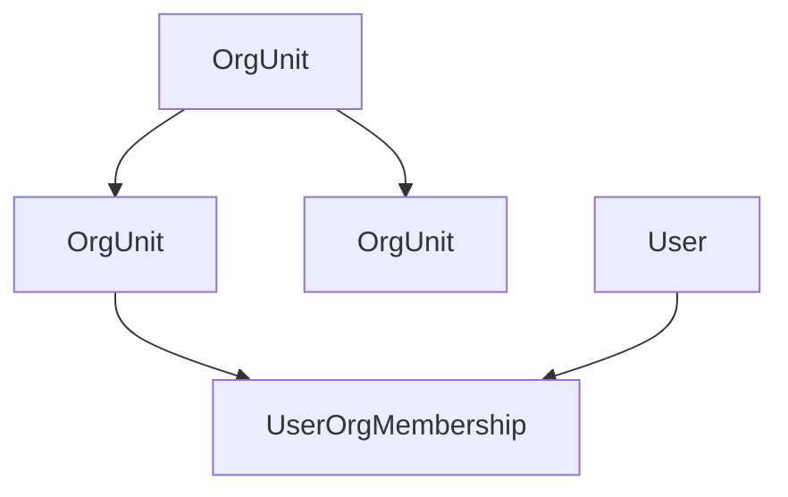

# POMS 组织单元详细设计

**文档状态**: Review
**最后更新**: 2026-03-10
**适用范围**: `POMS` 第一阶段平台治理域中的组织单元模块
**关联文档**:

- 上游设计:
  - `../poms-requirements-spec.md`
  - `../poms-hld.md`
  - `platform-governance-design.md`
- 同级设计:
  - `user-management-design.md`
  - `role-permission-design.md`
- 相关 ADR:
  - `../../adr/002-org-unit-model-and-assignment.md`
  - `../../adr/008-current-user-profile-output-contract.md`

---

## 1. 文档目标

本文档用于在平台治理域总设计与用户管理设计基础上，进一步明确第一阶段组织单元模块的对象边界、树结构规则、启停与层级调整规则、与用户关系的衔接、审计要求以及管理端实现收敛原则，为后续组织单元接口、管理页和用户组织关系实现提供稳定输入。

本文档重点回答：

- 第一阶段 `OrgUnit` 的正式模型应该是什么
- 组织树如何建模与维护
- 启停、删除、移动、排序等操作应遵守哪些规则
- 组织单元与用户主责/附属关系如何衔接
- 当前共享契约中的轻量 `UnitOrg` 与正式组织模型是什么关系

---

## 2. 设计范围

### 2.1 第一阶段纳入范围

- 组织单元正式模型
- 树结构与层级维护规则
- 启用/停用规则
- 删除限制与移动限制
- 排序规则
- 与用户组织关系的衔接
- 组织树查询与轻量视图输出原则
- 审计与测试要求

### 2.2 第一阶段不展开的内容

- 用户-组织-角色三元授权模型
- 按组织子树做数据范围权限
- 按组织子树做管理范围权限
- 跨公司、多租户组织隔离
- 复杂组织编制、岗位、编岗一体化建模

---

## 3. 上游约束

本设计继承以下已固定结论：

- 第一阶段组织单元采用树结构
- 组织单元第一阶段主要承担归属、统计、审批默认归口和层级展示职责
- 第一阶段不把组织上下文权限计算接入主授权链路
- 用户必须绑定一个主责组织，可保留附属组织能力
- 停用组织不得再作为新建或修改用户时的可选组织

---

## 4. 当前代码现状

结合当前仓库实现，组织单元已有以下现实基础：

- ADR 已明确组织单元应演进为树结构正式模型
- 当前共享契约中的 `UnitOrg` 仅包含 `id/name/code/description`
- 当前 `SanitizedUserWithOrgUnits` 中的 `orgUnits` 仍基于轻量 `UnitOrg` 输出
- 当前真实组织树、启停、排序、父子关系管理尚未进入正式实现

这意味着第一阶段组织单元设计需要明确：

- 正式组织单元实体的完整口径
- 轻量 `UnitOrg` 只是展示视图，不等于组织管理正式模型

---

## 5. 核心对象与关系

### 5.1 核心对象

- `OrgUnit`
- `OrgUnitTreeNode`（树查询视图）
- `UnitOrg`（轻量输出视图）
- `UserOrgMembership`

### 5.2 关系草图

### 5.3 关系口径

- `OrgUnit` 是组织管理正式实体
- `OrgUnit` 通过 `parentId` 形成树结构
- `UserOrgMembership` 是用户与组织关系的正式来源
- `UnitOrg` 只是当前用户资料和轻量展示视图，不代表完整组织管理模型

---

## 6. `OrgUnit` 详细设计

### 6.1 组织单元定位

第一阶段 `OrgUnit` 用于表达：

- 用户主责归属与附属归属
- 平台管理中的组织层级维护
- 后续业务对象主责组织的预留边界
- 统计、筛选、审批默认归口的组织维度

第一阶段 `OrgUnit` 不用于表达：

- 复杂组织范围权限
- 独立岗位体系
- 成员编制或编岗体系

### 6.2 建议字段

| 字段                      | 说明                     |
| ------------------------- | ------------------------ |
| `id`                      | 组织单元主键             |
| `name`                    | 组织名称                 |
| `code`                    | 组织编码                 |
| `description`             | 组织说明                 |
| `parentId`                | 父组织标识；根节点可为空 |
| `isActive`                | 是否启用                 |
| `displayOrder`            | 同级排序值               |
| `createdAt` / `updatedAt` | 审计时间字段             |

### 6.3 轻量视图 `UnitOrg`

当前共享契约中的 `UnitOrg`：

- `id`
- `name`
- `code`
- `description`

第一阶段应明确：

- `UnitOrg` 仅作为轻量展示视图使用
- `UnitOrg` 不承载 `parentId`、`isActive`、`displayOrder` 等组织管理字段
- 若前端需要组织管理能力，应通过正式组织单元接口读取完整模型，而不是复用 `UnitOrg`

---

## 7. 树结构设计

### 7.1 树结构原则

- 组织单元采用单父节点树结构
- 每个非根节点必须且仅能有一个父节点
- 不允许形成循环父子关系
- 根节点数量第一阶段可允许为一个或多个，但应在实现中保持平台配置口径一致

### 7.2 父子关系规则

- 新建组织时必须明确其父节点或根节点身份
- 调整父级时必须校验不会形成环
- 不允许把节点移动到自己的后代节点之下
- 父节点停用后，子树必须按规则整体停用

### 7.3 树查询输出

第一阶段至少支持以下视图：

- 树形全量视图
- 单节点详情视图
- 轻量选择器视图

树形视图建议至少包含：

- 节点基础字段
- 子节点列表
- 是否启用
- 同级排序值
- 是否允许删除或调整父级的派生状态

---

## 8. 唯一性、排序与编码规则

### 8.1 唯一性规则

- 组织编码在系统内应唯一，或至少在第一阶段按全局唯一收敛
- 同一父节点下组织名称不应重复
- 若业务后续需要允许不同树分支重名，应通过后续 ADR 再放宽，而不是在第一阶段直接放松约束

### 8.2 排序规则

- `displayOrder` 用于表达同级组织排序
- 同级排序由后端负责整理后返回
- 前端组织树不应对后端已排序结果再做业务重排
- 若同级排序值冲突，后端应有稳定次序策略，避免树表显示抖动

---

## 9. 生命周期与操作规则

### 9.1 生命周期

第一阶段继续采用从简口径：

- `active`
- `inactive`

说明：

- 第一阶段继续使用 `isActive` 表达组织启停
- 若后续组织治理复杂度显著提升，可再演进为更显式状态机

### 9.2 创建规则

- 新建组织时必须满足名称与编码规则
- 若指定父节点，父节点必须存在且处于启用状态
- 新建时应明确初始排序值

### 9.3 编辑规则

- 可编辑名称、编码、说明、排序
- 编码变更必须纳入审计
- 若组织已被大量引用，编码变更应谨慎控制

### 9.4 停用规则

- 第一阶段采用“父节点停用时级联停用整棵子树”的规则
- 不允许父停子不停
- 停用组织后，不得再作为新建或修改用户时的可选组织
- 历史用户挂靠关系可保留，用于审计和历史回溯

### 9.5 删除规则

- 存在子节点时，不允许直接删除
- 已被用户关系引用时，不允许直接删除
- 第一阶段优先采用“停用而非删除”策略

### 9.6 移动规则

- 不允许将节点移动到已停用节点之下
- 不允许将节点移动到自身后代之下
- 已停用节点下不允许新建、移动或激活子节点
- 节点移动后应同步影响树路径和相关派生展示信息

---

## 10. 与用户管理的衔接

### 10.1 主责组织关系

- 每个用户必须且仅有一个有效主责组织关系
- 该规则必须由持久化约束或等价一致性机制保证，不能只依赖前端校验
- 若用户主责组织被停用，历史关系可保留，但应阻止新建或继续调整到该停用组织

### 10.2 附属组织关系

- 用户可存在零个或多个附属组织关系
- 第一阶段附属组织只承担展示和归属补充作用，不参与主授权计算
- 停用组织不得新增附属绑定

`UserOrgMembership` 在组织单元语境下，第一阶段推荐状态枚举同样采用：

- `active`
- `revoked`

### 10.3 当前用户资料中的组织输出

当前用户资料中返回的 `orgUnits` 应是轻量组织视图，而不是完整组织管理实体。  
若需区分主责与附属关系，应在用户资料输出中明确关系语义，而不是依赖前端推断。

---

## 11. 管理能力边界

### 11.1 第一阶段建议开放的能力

- 查看组织树
- 创建组织单元
- 编辑名称、编码、说明、排序
- 调整父级
- 启用/停用组织
- 查看组织引用情况，如用户挂靠数量

### 11.2 第一阶段不建议开放的能力

- 组织范围权限配置
- 按组织子树限制谁可管理哪棵树
- 批量导入复杂组织编制信息
- 删除大量已引用组织节点

---

## 12. 审计要求

以下动作必须审计：

- 组织创建、编辑、启用、停用
- 父子关系调整
- 排序调整
- 删除尝试与删除拒绝
- 停用节点下新建/移动/激活被拒

以下内容应保留结构化前后值：

- 组织名称、编码、说明变更
- 父节点变更
- 启停状态变更
- 排序值变更

---

## 13. 测试与验收要点

第一阶段至少覆盖以下场景：

- 组织树可正确返回父子层级
- 不允许形成循环父子关系
- 父节点停用后子树整体停用
- 停用组织不能再作为用户新关系绑定目标
- 存在子节点或引用关系时删除被拒
- 同级排序稳定生效
- 主责组织唯一性约束在真实关系落库时可被保障

---

## 14. 与后续设计的衔接

本文档输出后，应作为以下设计的直接输入：

- `user-management-design.md`
- 后续组织单元接口与管理端页面设计
- 后续业务对象主责组织建模设计

其中：

- 向用户管理设计输出主责/附属组织绑定规则
- 向组织管理页面输出树表、选择器和启停规则
- 向后续业务域设计输出“主责组织”这一稳定归属边界

---

## 15. 当前仍待后续决定的问题

- 根节点数量是否长期允许多个
- 组织编码是否最终采用全局唯一还是局部唯一
- 是否在后续引入组织作用域授权
- 是否在后续引入更复杂的岗位、编制或汇报关系模型
