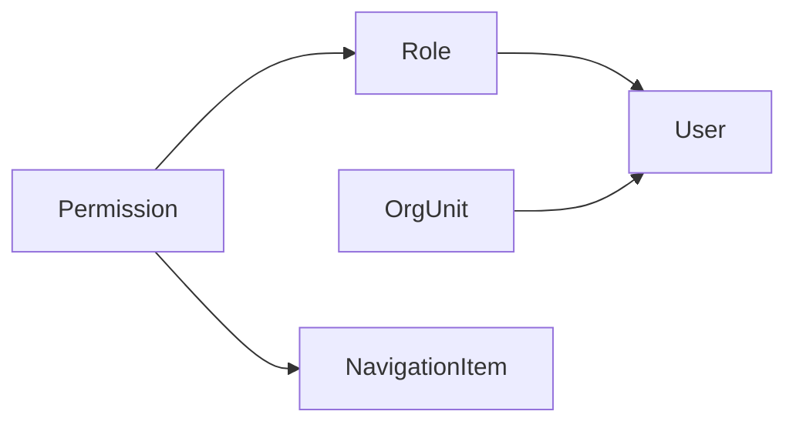

# POMS 平台治理域详细设计

**文档状态**: Review
**最后更新**: 2026-03-10
**适用范围**: `POMS` 第一阶段平台治理域
**关联文档**:

- 上游设计:
  - `../poms-requirements-spec.md`
  - `../poms-hld.md`
  - `../poms-design-progress.md`
- 相关 ADR:
  - `../../adr/001-platform-permission-model.md`
  - `../../adr/002-org-unit-model-and-assignment.md`
  - `../../adr/003-navigation-single-source-of-truth.md`
  - `../../adr/008-current-user-profile-output-contract.md`
  - `../../adr/009-platform-navigation-group-visibility-rule.md`
  - `../../adr/010-platform-user-management-route-bridging-status.md`

---

## 1. 文档目标

本文档用于在 `poms-requirements-spec.md` 和 `poms-hld.md` 的基础上，进一步明确 `POMS` 平台治理域的模块边界、核心对象、关键规则、状态约束和前后端协同方式，为后续平台模块实现提供稳定输入。

本文档重点回答：

- 平台治理域四个子模块分别负责什么
- 用户、角色、权限、组织、导航之间如何建立稳定关系
- 哪些规则属于平台权限，哪些规则不应混入业务对象动作授权
- 后端与前端在授权和导航上的职责边界是什么
- 第一阶段平台治理域应先落哪些最小闭环能力

---

## 2. 设计范围

### 2.1 第一阶段纳入范围

- 用户管理
- 角色与权限
- 组织单元
- 导航菜单

### 2.2 本文档覆盖内容

- 平台治理域子模块边界
- 核心实体与关系草图
- 关键状态与生命周期约束
- 授权与导航规则
- 审计与变更控制要求
- 第一阶段实施顺序建议

### 2.3 本文档暂不展开的内容

- 复杂数据范围权限
- 用户-组织-角色三元授权模型
- 完整 SSO、LDAP、AD 同步
- 多租户、多公司隔离
- 平台级可视化工作流编排

### 2.4 第一期认证策略

第一阶段认证能力在平台治理域内按以下口径收敛：

- 采用本地账号密码登录作为第一阶段正式认证模式
- 第一阶段不以统一登录、SSO、LDAP、AD 同步作为前置条件
- 第一阶段最小闭环要求用户可基于本地账号密码登录，并基于有效角色获得平台访问能力
- 登录成功后由后端签发短时效访问令牌，前端持有访问令牌并加载当前用户信息与导航树
- 第一阶段不把独立 `refresh token` 机制作为最小闭环前提，如后续引入，应在认证子设计中补充
- 第一阶段不承诺完整的自助注册、自助找回密码、密码过期、账户锁定策略
- 第一阶段可预留管理员初始化密码和重置密码能力，但不要求在本总设计中展开到界面与流程细节

---

## 3. 上游约束与设计原则

平台治理域详细设计必须继承以下已固定结论：

- 第一版以平台级 RBAC 为主，后端是授权单一可信源
- 组织单元第一版采用树结构，但不直接进入主授权链路
- 导航由后端统一输出并按权限过滤，前端忠实渲染
- 平台权限用于登录、菜单、页面和接口访问控制，不替代业务对象动作授权
- JWT 只承载轻量身份与必要权限上下文，不直接携带完整组织树和完整角色对象

基于以上约束，平台治理域继续遵循以下原则：

- **稳定事实源优先**: 权限字典、角色权限关系、组织层级、导航树都应有明确唯一事实源
- **边界清晰**: 平台管理负责平台访问控制和基础治理，不吞并业务流程审批与业务对象授权
- **后端主导**: 授权判定、导航过滤、关键约束校验由后端负责
- **前端忠实呈现**: 前端负责页面守卫、交互反馈和展示层体验，不独立定义授权事实
- **渐进建设**: 先形成可管理、可审计、可扩展的基础模型，再决定是否演进到复杂作用域授权

---

## 4. 子模块边界

### 4.1 用户管理

职责：

- 维护平台登录用户基础信息
- 维护用户启停状态
- 维护用户主责组织与附属组织关系
- 维护用户角色分配结果
- 提供用户查询、详情、变更和审计视图

不负责：

- 直接定义权限字典
- 决定业务对象动作权限
- 独立维护导航结构

### 4.2 角色与权限

职责：

- 维护平台权限字典的使用关系
- 维护角色基础信息、启停状态和系统角色标记
- 维护角色与权限集合的关联
- 为授权校验和导航过滤提供统一权限集合

不负责：

- 承担组织作用域授权
- 直接替代业务权限矩阵
- 直接承载导航树结构

### 4.3 组织单元

职责：

- 维护组织树结构
- 维护组织编码、名称、父子关系、排序和启停状态
- 承担用户归属与未来业务归属的基础边界
- 为统计、筛选、审批归口预留组织维度

不负责：

- 第一阶段主授权链路中的权限计算
- 独立决定某用户能操作哪些业务对象

### 4.4 导航菜单

职责：

- 维护平台信息架构
- 维护导航项层级、排序、路由链接和展示属性
- 基于权限输出已过滤导航树
- 为前端菜单、面包屑和入口编排提供统一数据来源

不负责：

- 替代前端真实路由实现
- 替代接口级授权校验
- 定义业务动作权限矩阵

### 4.5 模块关系

| 模块       | 依赖输入           | 核心输出                             | 备注                         |
| ---------- | ------------------ | ------------------------------------ | ---------------------------- |
| 用户管理   | 组织单元、角色     | 用户资料、用户角色分配、用户组织归属 | 用户是平台访问主体           |
| 角色与权限 | 权限字典           | 角色权限集合、授权结果基础           | 角色是权限聚合器             |
| 组织单元   | 无上游业务依赖     | 组织树、用户归属边界                 | 第一阶段不直接参与主授权计算 |
| 导航菜单   | 权限集合、路由约束 | 按权限过滤后的导航树                 | 后端输出，前端忠实渲染       |

---

## 5. 核心对象与关系

### 5.1 核心对象

第一阶段平台治理域以以下核心对象为主：

- `User`
- `Role`
- `Permission`
- `OrgUnit`
- `NavigationItem`

### 5.2 关系草图

### 5.3 关系口径

- `Role` 聚合多个 `Permission`
- `User` 可分配多个 `Role`
- `User` 必须绑定一个主责 `OrgUnit`
- `User` 可关联附属 `OrgUnit`，但第一阶段不把其作为主授权计算前提
- `NavigationItem` 通过 `requiredPermissions` 与权限字典关联
- 导航是否返回给当前用户，由后端基于用户有效权限集合决定

### 5.4 建议的关键字段

#### `User`

- `id`
- `username`
- `displayName`
- `email`
- `phone`
- `isActive`
- `primaryOrgUnitId`
- `createdAt`
- `updatedAt`

说明：

- `primaryOrgUnitId` 用于表达用户主体上的主责组织归属口径
- `roleIds`、`secondaryOrgUnitIds` 等集合字段若出现在接口或视图模型中，只能作为聚合输出，不应作为关系事实源
- 用户与角色、用户与组织的正式事实源，应以下游子设计中的 `UserRoleAssignment` 与 `UserOrgMembership` 为准

#### `Role`

- `id`
- `roleKey`
- `name`
- `description`
- `isActive`
- `isSystemRole`
- `permissionKeys`

#### `Permission`

- `key`
- `name`
- `category`
- `description`
- `isSystemPermission`
- `status`
- `sourceType`

#### `OrgUnit`

- `id`
- `name`
- `code`
- `description`
- `parentId`
- `isActive`
- `displayOrder`

#### `NavigationItem`

- `id`
- `key`
- `type`
- `title`
- `subtitle`
- `link`
- `linkType`
- `icon`
- `displayOrder`
- `isHidden`
- `isDisabled`
- `requiredPermissions`
- `meta`
- `children`

#### `NavigationItem` 字段设计说明

`NavigationItem` 的字段设计需要考虑当前 `poms-admin` 的前端模板现状，但不能直接被前端模板的临时字段结构反向定义。第一阶段应遵循“后端共享契约稳定、前端通过适配层消费”的原则。

需要纳入正式契约的，是导航本身的稳定事实：

- 节点类型，如 `basic`、`group`、`collapsable`、`divider`
- 展示标题、图标、排序、隐藏、禁用
- 内部链接或外部链接
- 权限要求
- 树形层级关系
- 少量稳定扩展元数据

不建议直接把当前 Angular 模板的实现细节抬升为正式契约字段，例如：

- `routerLink` 数组结构
- `routerLinkActiveOptions`
- `queryParamsHandling`
- `replaceUrl`
- `class`
- `tooltipDisabled`

这些字段应停留在前端适配层，而不是直接进入 `NavigationItem` 的共享模型。

#### `NavigationItem` 建议字段口径

| 字段                  | 必填性   | 说明                                                          |
| --------------------- | -------- | ------------------------------------------------------------- |
| `id`                  | 必填     | 导航项唯一标识，用于持久化、审计和引用                        |
| `key`                 | 必填     | 稳定业务键，用于代码引用、默认配置和迁移比对                  |
| `type`                | 必填     | 节点类型，至少支持 `basic`、`group`、`collapsable`、`divider` |
| `title`               | 条件必填 | 展示标题；`divider` 可为空                                    |
| `subtitle`            | 可选     | 辅助展示文本；第一阶段可为空                                  |
| `link`                | 条件必填 | 跳转目标；`basic` 一般必填，`group`/`divider` 可为空          |
| `linkType`            | 建议必填 | 标识 `internal` 或 `external`，避免前端猜测链接语义           |
| `icon`                | 可选     | 图标类名；第一阶段沿用当前 PrimeIcons 口径                    |
| `displayOrder`        | 必填     | 同层级排序值                                                  |
| `isHidden`            | 必填     | 是否在返回导航树中过滤或隐藏                                  |
| `isDisabled`          | 必填     | 是否可点击                                                    |
| `requiredPermissions` | 可选     | 可见性所需权限集合；为空表示仅需登录                          |
| `meta`                | 可选     | 承载少量稳定扩展元数据，不承载前端框架私有配置                |
| `children`            | 可选     | 子导航节点集合                                                |

#### `meta` 字段使用约束

`meta` 只应用于承载跨前后端都稳定且不适合直接提升为一级字段的扩展语义，例如：

- `activeMatchPath`: 当前前端菜单高亮所需的路径匹配口径
- `badge`: 后续若确需展示轻量角标
- `featureFlag`: 某菜单是否受功能开关控制

`meta` 不应用于承载与某个前端框架强绑定的运行时参数。

### 5.5 关系建模约束

本节中的 `roleIds`、`secondaryOrgUnitIds`、`permissionKeys` 主要用于表达对象关系口径，不直接代表最终持久化结构。第一阶段实现应优先采用关系化建模，而不是把这些概念字段直接视为单表数组字段落库。

建议的关系实体至少包括：

- `UserRoleAssignment`：表达用户与角色的分配关系、来源、状态和审计信息
- `UserOrgMembership`：表达用户与组织的主责/附属关系、状态和审计信息
- `RolePermissionAssignment`：表达角色与权限键的绑定关系、变更记录和生效状态

采用关系化建模的原因包括：

- 便于记录单条分配级别的审计信息
- 便于支持停用而非直接删除
- 便于未来扩展生效时间、失效时间和来源渠道
- 便于处理兼职组织、角色调整和权限迁移

第一阶段仍可在接口 DTO 或视图模型中返回 `roleIds`、`secondaryOrgUnitIds`、`permissionKeys` 这类聚合结果，但不应据此反推底层持久化结构必须等同。

---

## 6. 关键规则设计

### 6.1 权限字典规则

- 权限字典是平台授权语义的统一来源
- 权限 key 命名应稳定且可长期复用，不以临时页面文案命名
- 菜单权限与业务操作权限可共用一套字典，但必须语义分层
- 建议继续采用 `nav:*`、`platform:*`、`project:*`、`contract:*`、`commission:*` 这类前缀分组
- 第一阶段禁止前后端分别维护两套权限 key
- 第一阶段权限字典采用“共享契约 + 后端内置种子”的治理模式，不开放后台任意新增权限 key
- `Permission.key` 一经发布即视为稳定标识，不允许通过原地改名完成语义迁移
- 权限迁移应采用“新增新 key + 废弃旧 key + 保留兼容窗口”的方式处理
- 第一阶段 `Permission` 至少支持 `启用 / 停用 / 废弃` 三种生命周期语义
- 系统权限默认标记为 `isSystemPermission=true`，不允许在管理端直接删除
- 被废弃的权限不得再分配给新角色，但历史审计和历史角色快照仍应可回溯
- 权限来源建议区分 `system-seeded` 与 `future-managed` 两类；第一阶段实际只启用 `system-seeded`
- 权限字典的新增、停用、废弃和迁移必须纳入审计记录

### 6.2 一期认证与会话规则

- 第一阶段采用本地账号密码登录
- 第一阶段以访问令牌作为会话载体，不把独立 `refresh token` 作为最小闭环前提
- JWT 只承载轻量身份与必要权限上下文，不把完整角色对象、组织树和导航树写入令牌
- 第一阶段不把自助注册、统一登录、外部目录同步视为正式范围
- 管理端可后续补充初始化密码和重置密码能力，但不影响本阶段平台治理域建模

### 6.3 权限变更后的生效与失效规则

- 后端授权判断不应完全信任访问令牌中的权限集合，令牌内权限只作为轻量上下文
- 每次关键接口鉴权与导航生成都应以服务端当前有效用户状态、角色关系和权限关系为准
- 用户被停用后，已有访问令牌在下一次请求时必须被后端拒绝
- 角色被停用、角色权限被收回、用户角色关系被移除后，接口授权应立即按新结果生效
- 菜单与导航树应在登录成功、应用初始化、当前用户权限变更后重新拉取，不允许长期缓存旧导航结果
- 若未来引入 `refresh token`，则刷新动作也必须触发最新用户上下文与导航重取
- 如后续鉴权压力显著升高，可再通过 `tokenVersion`、权限版本号或黑名单机制增强，但不改变“后端当前关系为准”的主原则

### 6.4 角色规则

- 角色是权限集合，不是数据范围集合
- 角色可启停，但被停用后不应自动删除历史分配记录
- 系统角色允许存在，但应限制直接删除和关键权限剥离
- 角色权限变更应记录操作人、变更前后权限集合和时间
- 用户的实际有效权限取其当前有效角色的权限并集
- 第一期倾向采用“系统预置角色 + 有限自定义角色并行”策略
- `isSystemRole=true` 的角色默认不可删除，可限制其关键权限被完全移除
- 自定义角色允许存在，但仍只能从系统已有权限字典中选配权限，不允许绕过权限字典自造权限 key

### 6.5 用户规则

- 用户必须绑定一个主责组织
- 用户可被分配多个角色
- 用户停用后不得继续登录和获取有效导航
- 用户变更主责组织、附属组织、角色时应形成审计记录
- 第一阶段不在 JWT 中持久携带完整角色和组织详情，避免高变化信息失真
- 用户与角色、用户与组织的关系应通过关系实体表达，不推荐在持久化层直接使用数组字段代替关系表

### 6.6 组织规则

- 组织单元采用树结构
- 同级组织编码必须唯一
- 删除组织时，如存在子组织或仍被用户引用，应默认禁止物理删除
- 组织停用后，不应影响历史审计和历史归属回溯
- 第一阶段优先采用“停用 + 禁止新增引用”策略，而不是高频物理删除
- 有引用的组织第一阶段只允许停用，不允许物理删除
- 停用组织可保留历史挂靠用户，但不得再作为新建或修改用户时的可选主责组织或附属组织
- 第一阶段采用“父节点停用时级联停用整棵子树”的规则，不允许父停子不停
- 已停用父节点下不允许新增、移动或激活子节点
- 组织移动不得跨入已停用节点之下

### 6.7 导航规则

- 导航树以后端返回结果为唯一可信来源
- 导航项是否可见，取决于用户有效权限集合与导航项 `requiredPermissions`
- 前端可基于路由元信息做辅助守卫，但不独立决定某导航项是否可访问
- 导航链接必须与前端真实路由保持一致
- 导航静态 fallback 只允许作为迁移期临时机制，不应成为长期架构
- `NavigationItem` 不应直接等同于当前 Angular 模板里的 `MenuItem`
- 前端应通过适配层把 `NavigationItem` 转换为模板所需的菜单视图模型
- 若当前前端菜单激活、展开或外链行为依赖额外字段，应通过适配规则或 `meta` 中的稳定元数据承载，而不是把模板私有字段直接写入共享契约
- `requiredPermissions` 在第一阶段默认采用 AND 语义，即数组中的权限必须全部满足
- 第一阶段不额外引入 `requiredPermissionMode`；如后续出现 OR 场景，再通过新增字段显式扩展
- `isHidden` 的优先级高于权限判断；被隐藏的导航不应进入返回结果
- `requiredPermissions` 不满足时导航不返回，而不是以“返回但禁用”的方式表达缺权
- `isDisabled=true` 仅适用于当前用户本应可见但暂时不可点击的菜单场景
- 第一期导航配置能力以有限维护为主：允许维护标题、图标、排序、隐藏、禁用和权限要求
- 第一阶段不允许通过后台随意新增未知路由节点，也不允许在未完成前端路由收敛前自由修改核心业务 `link`
- 登录成功、应用初始化、当前用户角色权限变化后，前端都应重新拉取导航树

### 6.8 基于当前 `poms-admin` 的适配约束

结合当前代码事实，第一阶段导航详细设计需额外考虑以下约束：

- `poms-admin` 当前菜单组件并不直接消费 `NavigationItem`，而是先由 `AuthStore` 转换为前端 `MenuItem`
- 当前静态 fallback 菜单使用了 `label`、`icon`、`routerLink`、`url`、`target`、`items`、`separator`、`path` 等字段语义
- 当前动态导航转换逻辑已经覆盖 `title -> label`、`icon -> icon`、`link -> routerLink`、`children -> items`、`divider -> separator`
- 但当前动态导航转换尚未完整覆盖父级菜单激活与展开所依赖的 `path` 语义
- 后端内置导航已开始使用 `/platform/*` 作为目标路径，而前端部分真实路由仍停留在 `/profile/*` 等历史路径下

因此，导航详细设计应明确以下原则：

- 正式契约以 `NavigationItem` 为准，不以模板 `MenuItem` 为准
- 适配层必须是设计的一部分，而不是实现时临时补丁
- `link` 字段必须与真实前端路由联动治理，不能只在后端单独维护
- 若前端菜单激活态需要 `path` 或等价概念，优先通过适配规则或 `meta.activeMatchPath` 提供，而不直接复用模板内部字段名
- 在 `/platform/*` 路由完成收敛前，导航配置与前端路由之间应建立显式对照表，避免菜单点击后落入错误页面

### 6.9 平台权限与业务权限的分层规则

- 平台权限解决“谁能进入哪些平台模块、页面和接口”
- 业务权限矩阵解决“谁能对哪个业务对象执行什么动作”
- 不允许用菜单显隐代替业务动作授权
- 不允许把项目、合同、提成等业务审批权限直接写入平台导航规则
- 后续 `business-authorization-matrix.md` 应与本设计保持分层一致

---

## 7. 状态与生命周期

### 7.1 `User`

- 状态：启用、停用
- 关键动作：创建、编辑、分配角色、调整组织、启用、停用
- 约束：
  - 停用用户不能登录
  - 停用用户保留历史操作人与审计可追溯性
  - 若未来支持密码锁定，应新增状态或安全属性，不在第一阶段混入基础启停状态

### 7.2 `Role`

- 状态：启用、停用
- 关键动作：创建、编辑、配置权限、启用、停用
- 约束：
  - 系统角色默认不可删除
  - 停用角色不再参与新增授权计算
  - 已分配过的角色停用后，用户历史审计中仍保留角色引用痕迹

### 7.3 `Permission`

- 状态：启用、停用、废弃
- 关键动作：发布、停用、废弃、迁移替代
- 约束：
  - `Permission.key` 已发布后不得原地改名
  - 系统权限默认不可删除
  - 废弃权限不得再分配给新角色
  - 权限迁移需记录新旧 key 对应关系、变更原因和兼容窗口

### 7.4 `OrgUnit`

- 状态：启用、停用
- 关键动作：创建、编辑、调整父级、排序、启用、停用
- 约束：
  - 停用组织默认不可再作为新用户主责组织
  - 存在子节点或关联用户时不允许直接删除
  - 父节点停用时应级联停用子树
  - 已停用节点下不允许新建、移动或激活子节点

### 7.5 `NavigationItem`

- 状态：启用、停用
- 关键动作：创建、编辑、调整层级、排序、启用、停用
- 约束：
  - 停用导航不再进入返回导航树
  - 导航变更需校验 `link` 与前端真实路由是否一致
  - 如菜单激活态需要额外匹配路径，应同步维护 `meta.activeMatchPath` 或等价适配规则
  - 父导航停用时，子导航处理策略应保持一致，不允许返回孤儿节点

---

## 8. 前后端职责边界

### 8.1 后端职责

- 维护权限字典、角色权限关系、组织树、导航数据
- 计算用户有效权限集合
- 基于当前用户实时状态执行鉴权，而不是仅信任令牌中的权限集合
- 对平台管理接口做权限校验
- 按权限过滤并返回导航树
- 记录关键管理动作的审计日志

### 8.2 前端职责

- 忠实渲染后端返回的导航树
- 维护 `NavigationItem -> MenuItem` 的适配层
- 通过路由守卫对未授权访问做辅助拦截
- 提供用户、角色、组织、导航的管理交互
- 对禁用、缺权限、引用冲突等场景提供清晰提示

### 8.3 明确不应由前端负责的事项

- 自行推导角色最终权限
- 自行拼装长期有效的导航事实源
- 仅根据按钮显隐代替真实授权
- 独立维护与后端不一致的权限 key

---

## 9. 审计与变更控制

以下动作必须纳入审计日志：

- 用户创建、停用、组织调整、角色调整
- 角色创建、启停、权限变更
- 组织创建、父子关系调整、启停、排序变更
- 导航创建、路径变更、层级调整、启停、排序变更
- 权限拒绝、路由访问拒绝等关键安全事件

以下记录不应只靠普通字段覆盖，应保留变更前后值或结构化快照：

- 角色权限集合变更
- 用户角色分配结果变更
- 用户主责组织变更
- 导航项权限要求变更

---

## 10. 第一阶段最小闭环

第一阶段平台治理域至少形成以下闭环：

1. 用户可通过本地账号密码登录，并基于有效角色获得平台访问能力
2. 管理员可维护角色并配置权限集合
3. 管理员可维护组织树，并把用户绑定到主责组织
4. 后端可按权限输出导航树，前端可忠实渲染并辅助拦截越权访问
5. 用户停用、角色变更和权限收回后，接口授权与导航结果可按当前关系立即收敛
6. 关键平台管理动作具备基本审计能力

---

## 11. 建议实施顺序

建议按以下顺序推进平台治理域实现：

1. 权限字典、认证方式与会话规则收敛
2. 用户、角色与关系分配闭环
3. 组织单元树结构与停用规则闭环
4. 导航路由、权限过滤与路由对照表闭环
5. 审计补强与管理端交互细化

这样安排的原因是：

- 认证方式、权限字典与角色模型决定平台访问主链路
- 用户管理需要依赖角色和组织基础模型
- 导航可信源收敛依赖有效权限集合和真实路由对照已经稳定
- 审计与异常提示适合在基础模型成形后统一补强

---

## 12. 与后续设计的衔接

本文档产出后，建议继续补以下文档：

- `user-management-design.md`
- `role-permission-design.md`
- `org-unit-design.md`
- `navigation-design.md`
- `business-authorization-matrix.md`

其中：

- 前四份文档用于把平台治理域按子模块继续下钻
- `business-authorization-matrix.md` 用于与销售流程域、合同资金域、提成治理域对齐业务对象动作授权边界

平台治理域需要向 `business-authorization-matrix.md` 输出的稳定输入至少包括：

- 当前用户的有效平台身份与 `roleKey`
- 当前用户可进入的模块与页面边界
- 平台访问控制相关的有效权限集合
- 不包含任何针对具体业务对象动作的授权结论

导航子设计还应明确产出以下正式输出物：

- `navigation-route-mapping.md`

---

## 13. 当前仍待后续决定的问题

以下问题不阻塞第一阶段平台治理域详细设计启动，但在后续实现中仍需继续收敛：

- 用户是否需要正式支持兼职组织的主次切换和生效时间
- 权限字典后续是否开放受控后台登记，而不再完全由代码种子维护
- 第一阶段之后是否需要把 `refresh token`、密码过期和账户锁定纳入正式认证闭环
- 是否需要引入更细粒度的页面区域或按钮级权限元数据治理
- 后续是否基于组织树扩展审批范围或数据范围授权
