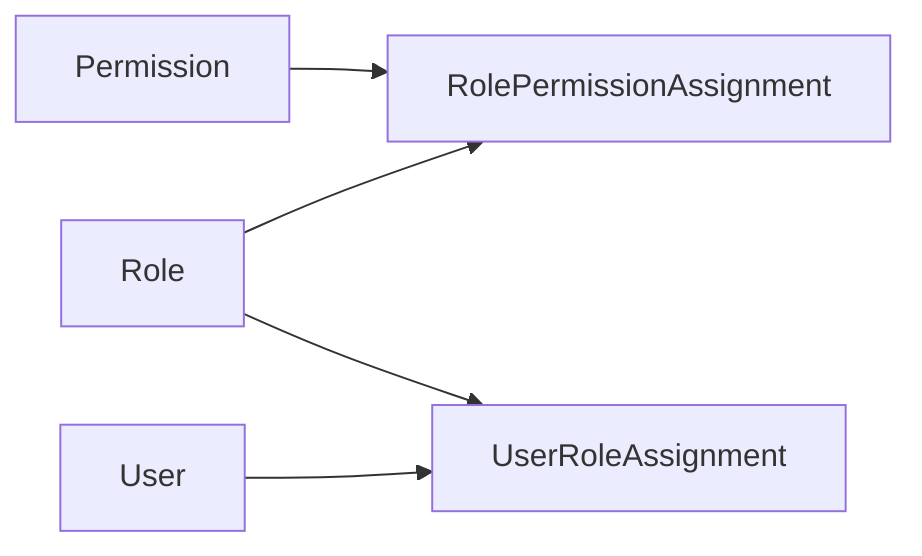

# POMS 角色与权限详细设计

**文档状态**: Review
**最后更新**: 2026-03-10
**适用范围**: `POMS` 第一阶段平台治理域中的角色与权限模块
**关联文档**:

- `platform-governance-design.md`
- `../poms-requirements-spec.md`
- `../poms-hld.md`
- `../../adr/001-platform-permission-model.md`

---

## 1. 文档目标

本文档用于在平台治理域总设计基础上，进一步明确第一阶段 `Role / Permission / RolePermissionAssignment` 的边界、治理方式、生命周期、审计要求和授权计算口径，为后续后端接口、管理端页面和权限守卫实现提供稳定输入。

本文档重点回答：

- 权限字典第一阶段如何维护
- 角色对象应具备哪些正式字段
- 角色与权限关系如何建模和审计
- 系统预置角色与自定义角色如何共存
- 用户最终有效权限如何计算并用于接口授权与导航过滤

---

## 2. 设计范围

### 2.1 第一阶段纳入范围

- 权限字典的治理与生命周期
- 角色对象的正式模型
- 角色与权限的绑定关系
- 系统预置角色与有限自定义角色
- 用户有效权限计算规则
- 角色权限相关的审计与测试要求

### 2.2 第一阶段不展开的内容

- 组织作用域授权
- 项目或数据范围级授权
- 页面区域级或按钮级细粒度权限元数据治理
- 动态表达式权限
- 第三方权限中心集成

---

## 3. 上游约束

本设计继承以下已固定结论：

- 第一版以平台级 RBAC 为主，基本关系为 `Permission -> Role -> User`
- 后端是授权单一可信源
- 菜单可见权限与业务操作权限共用统一权限字典，但语义必须分层
- JWT 只承载轻量身份与必要权限上下文，不能作为唯一权限事实源
- 第一阶段权限变更后的生效结果，以后端当前有效关系为准

---

## 4. 当前代码现状

结合当前仓库代码，角色与权限模块已有以下基础：

- 共享契约已经集中定义 `PERMISSION_KEYS` 和 `PermissionsMeta`
- 当前权限 key 已区分平台管理、项目、导航三类语义前缀
- `Role` 在共享契约中仍是轻量模型，仅包含 `id/name`
- 当前用户对象已可返回 `roles` 和 `permissions`

这意味着第一阶段设计重点不是从零定义权限体系，而是把现有“轻量骨架”收敛成正式可治理模型。

---

## 5. 核心对象与关系

### 5.1 核心对象

- `Permission`
- `Role`
- `RolePermissionAssignment`
- `UserRoleAssignment`（由用户管理模块持有，但本设计需要定义其权限计算语义）

### 5.2 关系草图

### 5.3 关系口径

- `Permission` 是稳定权限字典项
- `Role` 是权限集合的业务容器
- `RolePermissionAssignment` 是角色与权限的正式绑定关系
- `UserRoleAssignment` 是用户获得角色的正式来源
- 用户最终有效权限来源于其所有有效角色的有效权限并集

---

## 6. `Permission` 详细设计

### 6.1 来源模型

第一阶段采用“共享契约 + 后端内置种子”的权限字典治理模式：

- 权限 key 由共享契约集中维护
- 后端以内置种子或等价初始化机制登记到系统事实源
- 管理端第一阶段不开放任意新增权限 key 的能力
- 管理端可提供查看、分组展示、状态查看和引用分析能力

### 6.2 建议字段

| 字段                      | 说明                                 |
| ------------------------- | ------------------------------------ |
| `key`                     | 权限稳定标识，系统内唯一             |
| `name`                    | 权限展示名称                         |
| `description`             | 权限说明                             |
| `group`                   | 权限分组，如平台管理、导航、项目     |
| `status`                  | `active / inactive / deprecated`     |
| `isSystemPermission`      | 是否系统权限                         |
| `sourceType`              | 来源类型，第一阶段为 `system-seeded` |
| `deprecatedBy`            | 被废弃时的新权限 key                 |
| `createdAt` / `updatedAt` | 审计时间字段                         |

### 6.3 生命周期

- `active`：可被角色正常分配
- `inactive`：不再允许新增分配，但第一阶段默认保留存量有效关系的授权效力
- `deprecated`：已废弃，不允许再被新角色或新变更使用

### 6.4 关键规则

- `Permission.key` 一经发布不得原地改名
- 权限迁移必须通过“新增新 key + 废弃旧 key”的方式完成
- `inactive` 权限在第一阶段只阻止新增分配，不自动使存量有效关系失效
- 若需立即停止某权限的授权效力，应通过撤销 `RolePermissionAssignment` 或将该权限迁移为 `deprecated` 处理
- `deprecated` 权限必须保留历史审计可追溯性
- 系统权限第一阶段不允许删除
- 任何权限字典变更都必须纳入审计日志

### 6.5 权限 key 命名约束

第一阶段继续沿用前缀分层：

- `platform:*`：平台管理与平台接口能力
- `nav:*`：导航可见性控制
- `project:*`、`contract:*`、`commission:*`：业务域动作权限

命名约束如下：

- 使用英文小写与冒号分层
- 语义必须稳定，避免与短期页面文案绑定
- 导航可见性权限与业务动作权限不得混名
- 不允许通过创建“超级通配权限”绕开显式字典治理

---

## 7. `Role` 详细设计

### 7.1 角色定位

`Role` 是权限集合，不是组织范围或数据范围的承载体。第一阶段角色只回答：

- 谁能进入哪些平台模块
- 谁能调用哪些平台或业务接口
- 谁能看到哪些导航项

### 7.2 建议字段

| 字段                      | 说明                             |
| ------------------------- | -------------------------------- |
| `id`                      | 角色主键                         |
| `roleKey`                 | 角色稳定键                       |
| `name`                    | 角色名称                         |
| `description`             | 角色说明                         |
| `isActive`                | 是否启用                         |
| `isSystemRole`            | 是否系统预置角色                 |
| `displayOrder`            | 排序值                           |
| `permissionKeys`          | 视图层聚合字段，不代表持久化结构 |
| `createdAt` / `updatedAt` | 审计时间字段                     |

### 7.3 生命周期

- `active`：参与正常授权计算
- `inactive`：保留历史记录，但不再参与新增分配和后续授权计算

### 7.4 关键规则

- 第一阶段采用“系统预置角色 + 有限自定义角色并行”策略
- `isSystemRole=true` 的角色默认不可删除
- 系统角色可允许有限编辑描述和排序，但必须定义“最小权限基线”或“锁定权限集合”
- 低于系统角色最小权限基线的变更应被直接拒绝并审计
- 自定义角色允许新增，但只能从现有权限字典中选择权限
- 角色名可调整，`roleKey` 不建议频繁变更
- 停用角色后，相关用户的有效权限应在后端授权结果中立即收敛

---

## 8. 关系模型设计

### 8.1 `RolePermissionAssignment`

建议作为正式关系实体建模，而不是把权限 key 直接作为角色表中的非结构化数组唯一事实源。

建议字段：

- `id`
- `roleId`
- `permissionKey`
- `status`
- `assignedBy`
- `assignedAt`
- `revokedBy`
- `revokedAt`
- `changeReason`

第一阶段推荐状态枚举：

- `active`
- `revoked`

关键规则：

- 同一 `roleId + permissionKey` 在有效状态下应唯一
- 撤销权限应保留关系记录，不建议直接物理删除
- 角色权限调整必须形成结构化审计记录

### 8.2 `UserRoleAssignment`

该实体由用户管理模块主导，但与角色模块的授权计算强相关。

建议字段：

- `id`
- `userId`
- `roleId`
- `status`
- `assignedBy`
- `assignedAt`
- `revokedBy`
- `revokedAt`
- `changeReason`

关键规则：

- 用户有效权限只取其有效 `UserRoleAssignment` 对应的有效角色
- 用户被停用后，即使关系记录仍在，也不得继续获得有效权限
- 用户角色关系变更后，导航和接口授权应按最新关系即时收敛

---

## 9. 有效权限计算规则

### 9.1 计算口径

用户最终有效权限按以下顺序计算：

1. 读取当前用户状态
2. 读取当前用户的有效 `UserRoleAssignment`
3. 过滤掉已停用角色
4. 读取这些角色的有效 `RolePermissionAssignment`
5. 按权限生命周期规则处理 `inactive / deprecated` 权限项
6. 对剩余权限 key 取并集，得到用户当前有效权限集合

第一阶段对第 5 步的具体解释如下：

- `inactive` 权限默认不从存量有效关系中剔除
- `deprecated` 权限不再参与新的授权分配，是否继续参与历史关系授权应以迁移策略为准
- 若目标是立即停止授权，应通过撤销关系或完成显式迁移，而不是仅依赖 `inactive`

### 9.2 关键约束

- 后端授权不应只信任 token 内权限集合
- token 中的权限上下文仅用于轻量传递与基础体验优化
- 接口鉴权和导航过滤都应以服务端当前有效关系为准
- 用户停用、角色停用、角色剥权后，下一次请求必须体现新授权结果

### 9.3 与导航的关系

- `nav:*` 权限只影响导航可见性和页面入口体验
- 菜单看得见不等于接口可访问
- 导航过滤与接口鉴权共享同一权限事实源，但语义层必须区分
- 不得以 `nav:*` 权限替代业务接口授权
- 第一阶段 `group` 类型导航父节点默认不额外声明独立 `nav:*` 可见权限，其可见性由可见子节点派生
- `ADR-009` 已正式确定平台配置父组不再要求独立 `nav:platform:view`

---

## 10. 管理能力边界

### 10.1 第一阶段建议开放的能力

- 查看权限字典
- 查看权限分组和说明
- 新增自定义角色
- 编辑角色名称、描述、排序
- 为角色配置权限集合
- 停用角色
- 查看角色被哪些用户引用

### 10.2 第一阶段不建议开放的能力

- 在后台任意新增权限 key
- 删除系统权限
- 在后台直接改权限 key
- 在后台直接做复杂权限表达式配置
- 通过角色直接承载组织作用域授权

---

## 11. 审计要求

以下动作必须审计：

- 角色创建、编辑、停用
- 角色权限新增、撤销、批量替换
- 自定义角色删除尝试或系统角色删除拒绝
- 权限字典停用、废弃、迁移
- 关键鉴权拒绝事件

第一阶段“关键鉴权拒绝事件”至少包括：

- 已登录用户访问无权接口被拒
- 用户角色或权限变更后，旧入口或旧接口访问被拒
- 系统角色非法删除或低于最小权限基线的剥权尝试被拒
- 权限字典非法变更尝试被拒

以下内容应保留结构化前后值：

- 角色权限集合前后差异
- 角色基础字段前后差异
- 权限字典状态变化
- 废弃权限与替代权限的映射关系

---

## 12. 测试与验收要点

第一阶段至少覆盖以下场景：

- 用户通过多个角色获得权限并集
- 角色停用后用户接口权限立即失效
- 角色剥夺某权限后导航与接口结果同步收敛
- `inactive` 权限阻止新增分配，但不自动使存量有效关系失效
- 已废弃权限不能再分配给新角色
- 系统角色不可删除
- 系统角色低于最小权限基线的变更被拒绝并审计
- 自定义角色只能选择现有权限 key
- 菜单可见但接口无权访问时，后端仍正确拒绝

---

## 13. 与后续设计的衔接

本文档输出后，应作为以下设计的直接输入：

- `user-management-design.md`
- `navigation-design.md`
- `business-authorization-matrix.md`
- 后续认证 / 会话失效控制设计

其中：

- 向 `user-management-design.md` 输出用户角色关系模型与生效规则
- 向 `navigation-design.md` 输出导航可见性权限语义与匹配口径
- 向 `business-authorization-matrix.md` 输出平台访问权限边界，但不输出具体业务对象动作授权结论
- 向后续认证 / 会话设计输出“角色剥权、用户停用后的会话失效控制需求”

---

## 14. 当前仍待后续决定的问题

- 角色是否需要支持更细粒度的复制、模板化和批量授权能力
- 权限字典是否在后续开放受控后台登记
- 是否引入 `refresh token`、`tokenVersion` 或黑名单机制增强会话失效控制
- 是否在后续支持按钮级或字段级权限元数据治理
