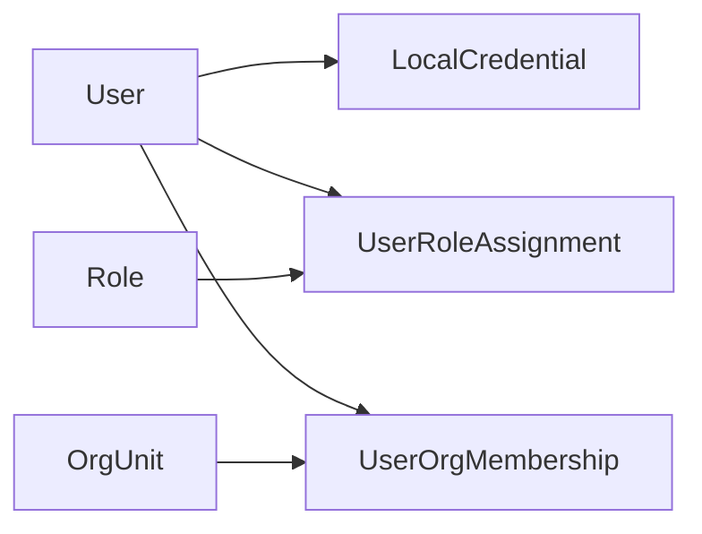

# POMS 用户管理详细设计

**文档状态**: Review
**最后更新**: 2026-03-10
**适用范围**: `POMS` 第一阶段平台治理域中的用户管理模块
**关联文档**:

- 上游设计:
  - `../poms-requirements-spec.md`
  - `../poms-hld.md`
  - `platform-governance-design.md`
- 同级设计:
  - `role-permission-design.md`
  - `org-unit-design.md`
- 相关 ADR:
  - `../../adr/001-platform-permission-model.md`
  - `../../adr/002-org-unit-model-and-assignment.md`
  - `../../adr/008-current-user-profile-output-contract.md`

---

## 1. 文档目标

本文档用于在平台治理域总设计与角色权限设计基础上，进一步明确第一阶段用户管理模块的对象边界、关系模型、账户状态、认证衔接、组织归属、角色分配、审计要求和实现收敛原则，为后续用户管理接口、管理端页面和认证/会话设计提供稳定输入。

本文档重点回答：

- 第一阶段 `User` 的正式模型应该是什么
- 用户与角色、用户与组织如何进行关系化建模
- 本地账号密码登录与用户状态如何衔接
- 用户停用、角色调整后，会话与访问能力如何收敛
- 管理端第一阶段建议开放哪些用户管理能力

---

## 2. 设计范围

### 2.1 第一阶段纳入范围

- 用户基础资料模型
- 账户启停状态
- 用户与角色关系模型
- 用户与组织关系模型
- 本地账号密码认证的用户侧约束
- 当前登录用户资料输出
- 用户管理相关审计与测试要求

### 2.2 第一阶段不展开的内容

- 统一登录、SSO、LDAP、AD 同步
- 多租户、多公司用户隔离
- 完整密码策略、密码过期、账户锁定
- 复杂兼职组织主次切换与生效时间
- 用户自助注册、自助找回密码
- 用户画像、绩效、考勤等 HR 属性

---

## 3. 上游约束

本设计继承以下已固定结论：

- 第一阶段采用本地账号密码登录
- JWT 只承载轻量身份与必要权限上下文，不承载完整角色对象和组织树
- 后端鉴权以当前有效用户状态、角色关系和权限关系为准
- 用户必须绑定一个主责组织
- 用户可保留附属组织能力，但第一阶段不进入主授权计算
- 用户与角色、用户与组织关系应采用关系化建模

---

## 4. 当前代码现状

结合当前仓库实现，用户管理与认证已有以下现实基础：

- 后端 `auth/login` 当前使用开发期硬编码用户与明文密码，仅用于本地联调
- 后端 `auth/profile` 当前返回 `SanitizedUserWithOrgUnits`
- 当前 `profile` 返回数据中 `roles` 仍为空数组，`orgUnits` 也为空数组，说明真实关系模型尚未接入
- 当前共享契约中 `SanitizedUser` / `SanitizedUserWithOrgUnits` 已具备基础用户展示字段
- 前端 `poms-admin` 的用户列表与创建页仍主要是模板演示数据，尚不是系统真实用户管理实现

这意味着第一阶段用户管理设计需要明确两层边界：

- 正式目标模型是什么
- 当前模板实现哪些只是过渡 UI，不应反向定义正式模型

---

## 5. 核心对象与关系

### 5.1 核心对象

- `User`
- `LocalCredential`
- `UserRoleAssignment`
- `UserOrgMembership`
- `SanitizedUser`
- `SanitizedUserWithOrgUnits`

### 5.2 关系草图

### 5.3 关系口径

- `User` 是平台访问主体
- `LocalCredential` 是本地账号密码认证所对应的凭证主体
- `UserRoleAssignment` 是用户获得平台角色的正式来源
- `UserOrgMembership` 是用户与组织关系的正式来源
- 一个用户必须且仅必须存在一个有效主责组织关系
- 一个用户可存在零个或多个附属组织关系
- 用户最终有效权限来自其有效角色关系，不直接由组织关系计算
- 第一阶段 `User` 只表达用户主体；本地密码信息应由独立认证/凭证模型承载，至少在实现层与 `User` 主体逻辑分离

---

## 6. `User` 详细设计

### 6.1 用户定位

第一阶段 `User` 用于表达：

- 登录身份
- 平台访问主体
- 基础资料维护对象
- 角色与组织关系的汇聚点

第一阶段 `User` 不用于表达：

- 业务对象内的项目角色身份
- 数据范围权限容器
- 完整人事档案对象

### 6.2 建议字段

| 字段                      | 说明               |
| ------------------------- | ------------------ |
| `id`                      | 用户主键           |
| `username`                | 登录名，系统内唯一 |
| `displayName`             | 展示姓名           |
| `email`                   | 邮箱               |
| `phone`                   | 手机号             |
| `avatarUrl`               | 头像地址           |
| `isActive`                | 账户是否启用       |
| `emailVerified`           | 邮箱是否验证       |
| `phoneVerified`           | 手机是否验证       |
| `lastLoginAt`             | 最近登录时间       |
| `createdAt` / `updatedAt` | 审计时间字段       |

字段分层说明：

- 主体标识字段：`id`、`username`
- 展示字段：`displayName`、`email`、`phone`、`avatarUrl`
- 状态字段：`isActive`、`emailVerified`、`phoneVerified`
- 审计字段：`lastLoginAt`、`createdAt`、`updatedAt`
- 认证凭证字段，如密码哈希、密码更新时间、失败次数、锁定信息，不属于 `User` 主体字段，应由独立认证/凭证模型承载

### 6.3 账户状态

第一阶段账户状态采用从简口径：

- `active`：可参与登录、资料读取、角色计算、导航生成
- `inactive`：不得继续登录；下一次请求必须被后端拒绝

说明：

- 第一阶段继续用 `isActive` 表达账户启停，不强制引入更复杂的锁定/冻结/待激活枚举
- 若后续引入密码锁定、风控冻结、首次登录改密等能力，应通过新增安全状态扩展，而不是篡改当前启停语义

### 6.4 关键规则

- `username` 在系统内必须唯一
- 用户停用后不得继续登录
- 用户停用后保留历史审计与历史归属回溯能力
- 用户恢复启用后，可重新参与正常认证与授权计算
- 第一阶段不允许以删除用户代替停用用户

---

## 7. 认证与用户状态衔接

### 7.1 第一阶段认证口径

- 采用本地账号密码登录
- 登录成功后签发短时效访问令牌
- 前端持有访问令牌后，拉取当前用户资料与导航树
- 第一阶段不把独立 `refresh token` 作为最小闭环前提

### 7.2 登录校验规则

登录时至少应校验：

1. 用户名是否存在
2. 密码是否匹配
3. 用户状态是否为启用

若用户已停用，应直接拒绝登录，不允许继续签发访问令牌。

### 7.3 会话失效收敛规则

- 用户被停用后，已有访问令牌在下一次请求时必须被后端拒绝
- 用户角色关系变化后，后续导航与接口授权应按最新关系结果收敛
- 当前用户资料与导航应在登录成功、应用初始化、当前用户权限变化后重取
- 会话失效增强机制，如 `refresh token`、`tokenVersion`、黑名单等，不在本文档展开，但必须由后续认证/会话设计接管
- 当前端收到“用户已停用”“会话已失效”或等价认证失败响应后，应清理本地会话并回到登录态，避免继续展示已登录 UI

### 7.4 当前实现与目标设计的差距

当前开发期实现仍使用硬编码用户和明文密码，仅适合本地联调。后续接入真实用户存储时，至少需要补齐：

- 用户持久化存储
- 密码哈希校验
- 用户启停状态校验
- 用户角色关系与组织关系查询
- 当前用户资料的真实聚合输出

---

## 8. 用户与角色关系设计

### 8.1 `UserRoleAssignment`

该实体用于表达用户与角色的正式关系，而不是把 `roleIds` 直接作为持久化数组字段。

建议字段：

- `id`
- `userId`
- `roleId`
- `status`
- `assignedBy`
- `assignedAt`
- `revokedBy`
- `revokedAt`
- `changeReason`

第一阶段推荐状态枚举：

- `active`
- `revoked`

关键规则：

- 同一 `userId + roleId` 在有效状态下应唯一
- 撤销关系应保留历史记录，不建议直接物理删除
- 用户有效权限只计算有效角色关系
- 用户停用后，即使关系仍保留，也不得继续获得有效权限

### 8.2 与角色权限设计的衔接

- 用户管理模块不定义权限字典
- 用户管理模块负责维护“用户被分配了哪些角色”
- 用户最终能做什么，由角色权限设计和后端当前有效关系共同决定

---

## 9. 用户与组织关系设计

### 9.1 `UserOrgMembership`

该实体用于表达用户与组织的主责/附属关系。

建议字段：

- `id`
- `userId`
- `orgUnitId`
- `membershipType`：如 `primary / secondary`
- `status`
- `assignedBy`
- `assignedAt`
- `revokedBy`
- `revokedAt`
- `changeReason`

第一阶段推荐状态枚举：

- `active`
- `revoked`

### 9.2 关键规则

- 每个用户必须且仅有一个有效主责组织关系
- 用户可存在零个或多个有效附属组织关系
- 第一阶段附属组织不参与主授权计算
- 停用组织不得再作为新建或修改用户时的可选组织
- 若组织已停用，历史挂靠关系可保留，但不应再新增绑定
- 有效主责组织关系必须由持久化约束或等价一致性机制保障，不能仅依赖前端校验或普通服务层判断

### 9.3 第一阶段组织输出口径

对用户详情和当前用户资料，第一阶段建议输出：

- 主责组织
- 附属组织列表
- 组织树路径或展示名称可作为视图层派生信息

---

## 10. 当前用户资料输出设计

### 10.1 `SanitizedUser`

用于前端身份展示和基础会话上下文。

建议承载：

- `id`
- `displayName`
- `username`
- `roles`
- `permissions`
- `email`
- `avatarUrl`
- `isActive`
- `lastLoginAt`
- `emailVerified`
- `phoneVerified`
- `phone`

第一阶段正式返回口径建议锁定为：

- `roles`: `string[]`，返回当前用户有效 `roleKey` 集合，不返回完整角色对象
- `permissions`: `PermissionKey[]`，返回当前用户当前有效权限全集，不只返回平台权限子集
- 其余字段用于当前用户展示、顶部资料展示和基础会话上下文，不用于替代服务端鉴权判断

### 10.2 `SanitizedUserWithOrgUnits`

在 `SanitizedUser` 基础上增加：

- `orgUnits`

说明：

- 第一阶段该输出主要用于前端资料展示、顶部用户信息、管理页面预填与当前用户上下文
- 不应把完整角色对象、完整组织树或敏感安全字段直接暴露给前端

第一阶段正式返回口径建议锁定为：

- `orgUnits` 应返回轻量组织视图数组，而不是完整组织树
- `orgUnits` 的元素类型不应直接复用通用 `UnitOrg`，而应采用用户上下文专用轻量类型，如 `UserOrgUnitSummary`
- 每个组织项至少应能表达：`id`、`name`、`code`、`description`、`membershipType`
- 其中 `membershipType` 至少区分 `primary / secondary`
- 该用户上下文专用轻量类型应与通用 `UnitOrg` 分离，避免把用户关系语义混入所有组织展示场景
- `ADR-008` 已正式确定当前用户资料输出采用“单数组 + 用户上下文专用轻量类型”的口径，而不是 `primaryOrgUnit + secondaryOrgUnits` 的双字段结构

### 10.3 当前实现收敛建议

当前 `auth/profile` 里 `roles=[]`、`orgUnits=[]` 只是开发期占位，不应成为正式接口口径。  
后续实现应改为根据真实关系实体聚合返回：

- 当前用户有效 `roleKey[]`
- 当前用户有效 `PermissionKey[]`
- 当前用户主责组织与附属组织的轻量视图数组，元素类型以 `ADR-008` 定义的用户上下文专用轻量类型为准

---

## 11. 管理能力边界

### 11.1 第一阶段建议开放的能力

- 创建用户
- 编辑用户基础资料
- 启用/停用用户
- 分配/撤销角色
- 绑定主责组织
- 绑定/移除附属组织
- 查看用户详情与审计记录
- 管理员初始化密码或重置密码

### 11.2 第一阶段不建议开放的能力

- 用户自助注册
- 用户自助找回密码闭环
- 复杂密码策略配置中心
- 按组织批量授权与批量数据范围配置
- 通过用户直接绑定业务对象动作权限

### 11.3 管理员初始化密码与重置密码的最小安全语义

- 管理员初始化或重置密码时，不得回显旧密码或任何可逆凭证信息
- 密码在持久化层必须以不可逆形式存储，不得以明文或可逆密文保存
- 重置密码后，旧登录状态应在下一次请求时失效
- 上述“旧会话失效”的具体技术机制由后续认证/会话设计承接，但本规则本身属于第一阶段必须满足的安全语义

---

## 12. 审计要求

以下动作必须审计：

- 用户创建、编辑、启用、停用
- 用户角色分配与撤销
- 用户主责组织调整
- 用户附属组织增删
- 管理员初始化密码或重置密码
- 已停用用户登录尝试或访问被拒

以下内容应保留结构化前后值：

- 用户基础资料变更
- 用户角色集合变更
- 用户主责组织变更
- 用户附属组织集合变更
- 用户状态变更

---

## 13. 测试与验收要点

第一阶段至少覆盖以下场景：

- 启用用户可正常登录并获取当前用户资料
- 停用用户登录被拒
- 已登录用户被停用后，下一次请求被拒
- 用户被分配多个角色后，权限按并集生效
- 用户撤销角色后，导航与接口授权按最新关系收敛
- 用户必须存在且仅存在一个主责组织
- 停用组织不能再被绑定为用户新关系
- 当前用户资料返回不包含敏感安全字段

---

## 14. 与后续设计的衔接

本文档输出后，应作为以下设计的直接输入：

- 后续认证 / 会话失效控制设计
- `org-unit-design.md`
- 后续用户管理接口与管理端页面设计

其中：

- 向认证/会话设计输出“用户停用后下一次请求必须失效”的强约束
- 向组织设计输出用户组织关系模型与主责组织唯一性约束
- 向前端实现输出当前用户资料接口与用户管理页应对齐的正式字段口径

---

## 15. 当前仍待后续决定的问题

- 是否在后续引入 `refresh token`、`tokenVersion` 或黑名单机制增强会话失效控制
- 是否支持更复杂的兼职组织主次切换与生效时间
- 是否支持密码过期、账户锁定、首次登录改密
- 用户资料是否在后续接入更多 HR 或通讯录属性
