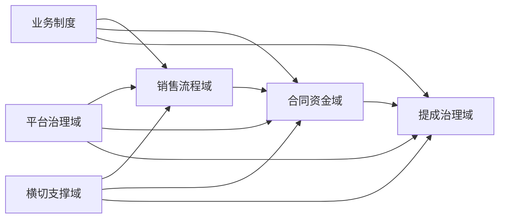
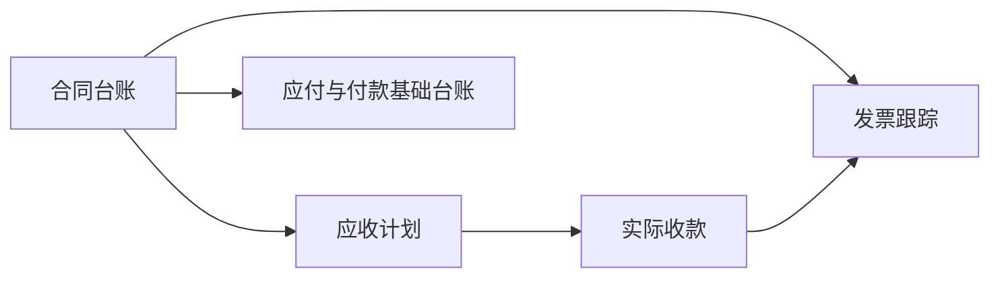
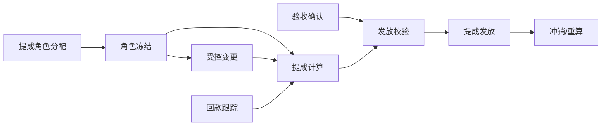
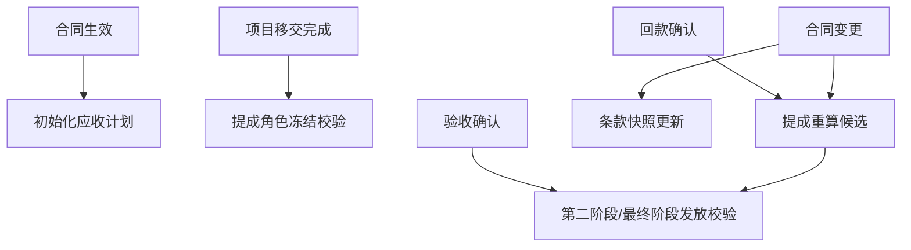

# POMS 高层设计（HLD）

**文档状态**: Accepted (Phase 1 Baseline)
**最后更新**: 2026-03-09
**适用范围**: `POMS` 全系统
**关联文档**:

- `poms-requirements-spec.md`
- `../adr/001-platform-permission-model.md`
- `../adr/002-org-unit-model-and-assignment.md`
- `../adr/003-navigation-single-source-of-truth.md`
- `../adr/004-contract-finance-domain-module-boundary.md`
- `../adr/005-approval-flow-implementation-strategy.md`
- `../adr/006-project-as-primary-domain-object.md`
- `../adr/007-phase1-finance-integration-and-recording-boundary.md`

---

## 1. 文档目标

本文档用于在 `poms-requirements-spec.md` 基础上定义 `POMS` 的系统蓝图，明确核心领域、模块边界、关键数据关系和主要业务流，为后续模块详细设计和开发实施提供高层约束。

如本文档与 `poms-requirements-spec.md` 存在冲突，以需求说明文档定义的需求边界、范围和规则口径为准。

本文档重点回答：

- 系统由哪些核心领域组成
- 各领域如何协同
- 横切能力如何统一建设
- 第一阶段优先落哪些模块
- 如何把需求说明中的关键规则落为稳定的系统蓝图

---

## 2. 系统定位

`POMS` 是一个围绕“项目型销售管理、风险控制、提成治理”建设的内部业务平台。

它既不是单纯的 CRM，也不是单纯的财务结算系统，而是连接以下几类能力的业务中台：

- 销售推进与项目管理
- 风险闸口与审批控制
- 合同、收付款、发票、项目移交的过程治理
- 提成规则执行、冻结与发放跟踪
- 平台级权限、组织和导航管理

---

## 3. 设计原则

- **制度驱动**: 系统设计必须以公司制度文档为依据
- **流程可阻断**: 关键闸口必须能阻断不合规流转
- **责任可追溯**: 关键动作必须可记录责任人与时间
- **规则显式化**: 关键业务规则不得依赖口头约定
- **平台能力先行**: 先稳住用户、权限、组织、导航等治理基础
- **渐进式建设**: 第一版避免过度设计，优先建立主链路闭环
- **需求优先**: HLD 必须承接需求说明中已经确定的范围、规则和边界，不反向定义需求

---

## 4. 逻辑架构

### 4.1 核心领域划分

建议将 `POMS` 分为以下核心领域：

- 平台治理域
  - 用户管理
  - 角色与权限
  - 组织单元
  - 导航菜单

- 销售流程域
  - 销售线索
  - 项目
  - 立项评估
  - 技术可行性与范围确认
  - 报价与毛利评审
  - 高层介入申请
  - 签约、合同与项目移交
  - 阶段性交付与验收确认

- 合同资金域
  - 合同台账
  - 应收计划与回款
  - 应付与付款跟踪基础台账
  - 发票管理
  - 合同、资金、发票联动查询

- 提成治理域
  - 提成角色分配
  - 提成角色冻结与受控变更
  - 提成池计算
  - 发放节点管理
  - 低首付款、质保金和异常场景处理
  - 异常调整 / 冲销 / 重算

- 横切支撑域
  - 审批与审计
  - 附件与文档
  - 通知与待办
  - 字典与配置

### 4.2 逻辑关系图

---

## 5. 核心模块说明

### 5.1 平台治理域

#### 用户管理

职责：

- 维护系统登录用户
- 关联平台角色与组织信息
- 维护启停状态和基础资料

#### 角色与权限

职责：

- 维护平台权限字典与角色
- 控制平台管理能力访问边界
- 为导航和页面守卫提供统一权限来源

#### 组织单元

职责：

- 维护组织树结构
- 承担用户归属与后续业务归属的基础边界

#### 导航菜单

职责：

- 维护系统信息架构
- 基于权限输出已过滤导航树

### 5.2 销售流程域

#### 销售线索

职责：

- 记录销售机会来源和基础判断
- 作为后续流程入口

#### 项目评估与推进

职责：

- 管理立项评估、技术确认、报价评审、高层介入、签约、移交和阶段验收确认等阶段
- `Project` 在第一阶段同时覆盖商机推进阶段与正式项目阶段，阶段差异通过状态机与里程碑表达
- 形成项目推进的状态主链路

### 5.3 合同资金域

#### 合同台账

职责：

- 维护项目相关合同及补充协议
- 记录合同关键条款、金额、税率、签约日期、状态和版本
- 支撑合同查询、履约跟踪和后续资金管理
- 当前有效合同口径由 `Contract + 最新有效 ContractAmendment + 对应 ContractTermSnapshot` 共同确定

#### 资金管理

职责：

- 维护应收计划、实际收款和待收款跟踪
- 第一阶段维护必要的应付与付款基础台账，支撑成本与毛利核算
- 回款数据第一阶段采用系统内录入并经财务确认生效，同时预留后续外部系统同步能力
- 为项目经营视图和提成计算提供资金维度数据

#### 发票管理

职责：

- 维护开票、收票和发票状态跟踪
- 关联合同、收付款和项目，支撑高频业务查询
- 第一阶段聚焦发票台账与状态管理，不先建设完整开票申请工作流

### 5.4 提成治理域

#### 提成角色分配

职责：

- 记录项目中的提成参与角色
- 维护分配比例、冻结、受控变更与版本

#### 提成计算与发放

职责：

- 区分预计毛利口径与最终贡献毛利口径，基于回款、成本和规则分档计算提成
- 记录应发、已发、冲销、扣回、异常处理和重算替代关系
- `CommissionPayout` 在第一阶段作为业务发放记录对象存在，不与真实财务付款动作强联动

#### 规则与版本

职责：

- 维护毛利审批规则、提成率分档规则和异常规则版本
- 为提成计算、审批路由和审计回溯提供统一规则来源

### 5.5 横切支撑域

#### 审批与审计

职责：

- 沉淀审批记录、意见、状态变化和关键字段变更

#### 附件与文档

职责：

- 维护关键业务输出物、合同扫描件、例外审批依据和移交材料
- 支撑关键节点附件必传、版本留存和预览访问

#### 通知与待办

职责：

- 承接审批、提醒、待处理任务和状态通知

---

## 6. 核心实体草图

第一版建议重点围绕以下实体建模：

- `User`
- `Role`
- `Permission`
- `OrgUnit`
- `NavigationItem`
- `Lead`
- `Project`
- `ProjectAssessment`
- `ScopeConfirmation`
- `QuotationReview`
- `ExecutiveEscalationRequest`
- `Contract`
- `ContractTermSnapshot`
- `ContractAmendment`
- `ReceivablePlan`
- `ReceiptRecord`
- `PayableRecord`
- `PaymentRecord`
- `InvoiceRecord`
- `AcceptanceRecord`
- `ProjectHandover`
- `CommissionRoleAssignment`
- `CommissionCalculation`
- `CommissionPayout`
- `CommissionAdjustment`
- `RuleVersion`
- `ApprovalRecord`
- `AuditLog`
- `Attachment`

> 后续模块设计需要进一步明确每个实体的字段、聚合边界和生命周期。

---

## 7. 关键流程视图

### 7.1 销售到签约主流程

### 7.2 合同、资金与发票主流程

### 7.3 提成主流程

### 7.4 领域协作与关键触发

---

## 8. 权限与组织架构

### 8.1 权限模型

遵循现有 ADR：

- 平台级 RBAC 为第一版主模型
- 权限字典统一维护
- 后端为授权单一可信源
- 前端做页面级辅助守卫

### 8.2 组织模型

遵循现有 ADR：

- 第一版组织单元采用树结构
- 暂不在第一版引入复杂组织作用域授权
- 组织单元优先承担归属和层级治理职责

### 8.3 业务权限设计约束

- 业务权限不以菜单显隐代替对象动作授权
- 后续详细设计需按“对象-动作-角色”矩阵落地业务权限
- 审批、确认、否决、冻结、重算、冲销、关闭等关键动作必须有明确角色边界

### 8.4 一期审批实现策略

- 一期采用“模块内审批流 + 统一待办聚合”策略
- 审批状态机内嵌于各业务对象，不先建设完整独立审批中心
- 公共能力负责统一待办、审批记录、通知和审计留痕
- 后续若审批规模、复用程度或流程配置需求显著提升，再考虑演进为更独立的审批中心

---

## 9. 前后端模块边界

### 9.1 后端

第一阶段后端模块边界与逻辑领域保持同构，合同资金域独立于 `sales` 拆分实现：

- `platform`
  - users
  - roles
  - permissions
  - org-units
  - navigation
- `sales`
  - leads
  - assessments
  - scope-confirmations
  - quotation-reviews
  - executive-escalations
  - handovers
  - acceptances
- `contract-finance`
  - contracts
  - receivables
  - payables
  - invoices
- `commission`
  - role-assignments
  - calculations
  - payouts
  - adjustments
  - rules
- `common`
  - approvals
  - audit
  - attachments
  - notifications
  - dictionaries

### 9.2 前端

建议前端按业务域组织页面与数据访问层：

- 平台管理
- 销售流程
- 合同资金
- 提成治理
- 公共能力

### 9.3 模块边界说明

- 销售流程域负责机会推进、流程闸口和项目阶段状态
- 合同资金域负责合同条款、应收回款、应付成本、发票台账及其联动查询
- 提成治理域不直接持有合同或回款事实源，而是消费销售流程域和合同资金域的生效数据
- 公共能力域为各业务模块提供审批、审计、附件、通知和字典能力
- 前端菜单按业务域组织，但不改变后端对象的事实归属

---

## 10. 数据流与一致性

### 10.1 关键一致性要求

- 项目关键阶段切换必须与审批记录一致
- 项目移交完成与提成角色冻结版本必须一致
- 报价审批毛利口径与提成结算毛利口径必须分离
- 第二阶段及最终阶段提成发放，必须引用有效 `AcceptanceRecord` 或阶段性成果确认记录作为前置条件之一
- 提成结果必须可以回溯到源数据和规则版本
- 关键冻结动作必须形成不可篡改的业务记录
- 导航、页面守卫与接口权限必须统一口径

### 10.2 关键数据可信源

| 数据主题                   | 单一可信源                                  | 说明                                                     |
| -------------------------- | ------------------------------------------- | -------------------------------------------------------- |
| 合同金额 / 税率 / 付款条款 | `Contract` + `ContractTermSnapshot`         | 合同主记录承载当前合同主体，快照承载生效时口径           |
| 合同补充协议               | `ContractAmendment`                         | 补充协议独立建模，不作为普通附件替代                     |
| 实际回款                   | `ReceiptRecord`                             | 以实际到账金额为准，到账日期用于规则触发                 |
| 回款生效口径               | `ReceiptRecord` 已确认记录                  | 第一阶段以系统内录入并经财务确认后的记录作为生效回款事实 |
| 成本                       | `PayableRecord` / `PaymentRecord`           | 第一阶段以成本台账为主，不含税口径进入毛利计算           |
| 验收节点                   | `AcceptanceRecord`                          | 作为第二阶段和最终阶段提成发放的重要前置依据             |
| 提成角色冻结版本           | `CommissionRoleAssignment`                  | 仅冻结版本可进入有效提成计算                             |
| 生效提成结果               | `CommissionCalculation`                     | 仅生效版本作为应发依据                                   |
| 提成发放与冲销结果         | `CommissionPayout` / `CommissionAdjustment` | 已发、已冲销、已扣回结果均需独立留痕                     |
| 规则来源                   | `RuleVersion`                               | 毛利审批规则、分档规则和异常规则统一以规则版本为准       |

### 10.3 不可变记录与版本化约束

- **Append-only**：已生效的提成计算结果、提成发放记录、冲销记录和扣回记录不得原地覆盖，只能追加新记录或新版本
- **Snapshot-first**：范围确认、报价评审、合同生效、例外审批和提成生效等关键结论必须绑定当时输入快照
- **Immutable milestone**：合同生效、项目移交完成、提成角色冻结、提成发放属于不可逆业务里程碑，不能被普通编辑直接改写
- **Version substitution**：当合同变更、回款变化、成本变化、违规处理或异常调整触发重算时，新版本必须显式标注替代关系与生效时间

### 10.4 关键风险点

- 制度条款中存在“人工裁量”与“系统自动规则”混合场景
- 项目合同、回款、提成计算可能存在时间差与回溯重算
- 低首付款、质保金、离职和违规处理会引入复杂提成发放分支
- 流程违规与提成资格绑定，需要明确判责和执行边界

---

## 11. 第一阶段实施建议

### 11.1 优先建设顺序

1. 平台治理域
2. 销售流程主链路
3. 合同资金基础闭环
4. 提成治理最小闭环
5. 横切支撑能力增强

### 11.2 第一阶段最小闭环

第一阶段最小闭环应与 `poms-requirements-spec.md` 保持一致，至少形成：

- 用户、角色、组织、导航管理
- 线索登记到签约移交的主流程闭环
- 合同台账、应收回款、发票台账的基础闭环
- 基于合同、回款与毛利的提成基础计算与发放记录
- 审批记录、审计记录、附件和通知能力可追踪

### 11.3 第一阶段范围边界

- 应付与付款跟踪第一阶段以基础台账为主，不作为完整审批闭环承诺
- 发票第一阶段以台账跟踪和状态管理为主，可为完整开票申请流程预留扩展
- 提成第一阶段必须支持分阶段发放、异常调整和重算留痕
- 提成发放第一阶段只做业务发放审批与发放记录，不与财务实际付款动作形成强联动
- 回款数据第一阶段采用系统内录入并经财务确认生效，同时在模型和接口层预留后续外部系统同步能力

---

## 12. 需要后续补充的设计

基于 `poms-requirements-spec.md` 与本 HLD，后续需要展开：

- 项目生命周期与状态机详细设计
- 审批流与风控闸口设计
- 业务权限矩阵设计
- 合同、资金与发票详细设计
- 提成计算与结算详细设计
- `platform-governance/user-management-design.md` 用户管理详细设计
- `platform-governance/role-permission-design.md` 角色与权限详细设计
- `platform-governance/org-unit-design.md` 组织单元详细设计
- `platform-governance/navigation-design.md` 导航菜单详细设计
- 审批与审计设计
