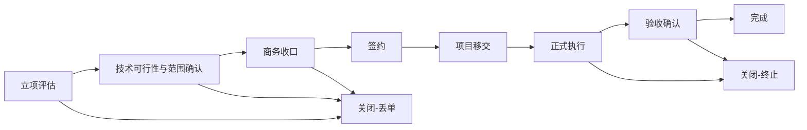

# POMS 项目生命周期设计

**文档状态**: Draft (Baseline)
**最后更新**: 2026-03-11
**适用范围**: `POMS` 第一阶段销售流程域中的 `Project` 主对象生命周期
**关联文档**:

- `poms-requirements-spec.md`
- `poms-hld.md`
- `business-authorization-matrix.md`
- `../adr/005-approval-flow-implementation-strategy.md`
- `../adr/006-project-as-primary-domain-object.md`
- `../adr/011-bid-tender-modeling-in-project-lifecycle.md`

---

## 1. 文档目标

本文档用于在需求说明、HLD 和已接受 ADR 的基础上，正式收敛 `Project` 的主生命周期、状态机、阻断规则、审批闸口和关键里程碑，为后续销售流程域、合同资金域、提成治理域和业务授权矩阵提供共同上游输入。

本文档重点回答：

- `Project` 的主阶段链路是什么
- 哪些节点是主状态推进，哪些属于附属受控流程或第一类子流程
- 每个阶段的进入条件、退出条件和阻断条件是什么
- 哪些动作需要审批，哪些动作只需确认或校验
- 哪些里程碑属于不可逆或需受控变更的业务事实

---

## 2. 当前阶段定位

当前文档处于：

**“销售流程域第一份详细设计基线，先固定 `Project` 生命周期主链路，再为合同资金、提成治理、审批流和业务授权矩阵提供稳定输入。”**

这意味着：

- 本文档先解决主对象生命周期和状态机问题
- 本文档同时明确 `Project` 与 `BidProcess` 的边界关系
- 本文档不一次性替代合同、回款、提成或审批流的详细设计
- 本文档的结论可直接作为后续对象动作矩阵和实现收敛的上游依据

---

## 3. 上游约束

本设计继承以下已固定结论：

- 第一阶段主对象正式命名为 `Project`
- `Lead` 负责最初线索阶段，`Project` 在线索转入正式推进后创建
- 第一阶段采用显式业务状态机与固定审批流
- 第一期审批采用“模块内审批流 + 统一待办聚合”
- 招投标采用 `Project` 主生命周期 + `BidProcess` 第一类受控子流程建模
- 签约后仍需独立完成 `ProjectHandover`，合同不是移交的替代物
- 未完成移交，不视为正式进入项目执行态
- 提成角色冻结版本必须与项目移交完成保持一致

---

## 4. 生命周期建模原则

- **主链路单一**: `Project` 需要有一条清晰的主推进链路，避免多个并行“主状态”来源
- **附属流程从属主链路**: 高层介入、审批、变更控制等属于附属受控流程，不应取代主阶段链路
- **主对象与子流程分层**: `Project` 负责表达主业务推进位置，`BidProcess` 负责表达投标细节事实与结果
- **阶段与审批分层**: 阶段表达“当前处于哪一步”，审批表达“当前动作能否放行”
- **成交路径显式化**: 是否采用招投标、框架下单或直接商务谈判，应作为签约前商务收口阶段的显式语义存在
- **里程碑显式化**: 合同生效、移交完成、验收确认等关键事实必须独立留痕，不应只靠普通字段覆盖
- **阻断优先**: 关键阶段未满足前置条件时，系统必须明确阻断推进，而不是默许跳过

---

## 5. `Project` 生命周期总览

### 5.1 主阶段链路

第一阶段建议将 `Project` 的主阶段链路收敛为：

1. `assessment`
2. `scope-confirmation`
3. `commercial-closure`
4. `contracting`
5. `handover`
6. `execution`
7. `acceptance`
8. `completed`

同时允许以下关闭结果：

- `closed-lost`
- `closed-terminated`

### 5.2 主阶段关系图

### 5.3 附属受控流程

以下内容第一阶段不建议直接升格为 `Project` 主阶段，而应作为附属受控流程或第一类子流程存在：

- `BidProcess` 招投标子流程
- `QuotationReview` 报价与毛利评审
- `ExecutiveEscalationRequest` 高层介入申请
- 范围、商务收口、签约、移交等节点上的审批实例
- 项目暂停、恢复、关闭申请
- 受控变更与例外审批

说明：

- `BidProcess` 是签约前的第一类业务子流程，但不单独占据 `Project.stage`
- `QuotationReview` 是商务收口阶段中的关键受控动作，而不是独立主阶段
- 高层介入申请可以发生在 `commercial-closure`、`contracting` 或其他特定卡点阶段
- 这样可以避免把“成交机制”或“例外流程”误建模成所有项目必经的主阶段

### 5.4 `BidProcess` 与 `Project` 的关系

第一阶段建议将 `Project` 与 `BidProcess` 的关系固定为：

- `Project` 始终是销售流程域的主对象
- `BidProcess` 仅在 `Project.commercialMode = bidding` 时出现
- 一个 `Project` 在任一时点通常只有一个“当前有效 `BidProcess`”
- `BidProcess` 记录投标决策、标书准备、递交、澄清、定标结果等细节事实
- `Project` 只引用当前有效 `bidProcessId` 与关键结果，不复制全部投标细节状态

---

## 6. 阶段定义

| 主阶段               | 目标                             | 进入条件                       | 退出条件                               | 主要输出                                   | 核心阻断                                             |
| -------------------- | -------------------------------- | ------------------------------ | -------------------------------------- | ------------------------------------------ | ---------------------------------------------------- |
| `assessment`         | 完成立项判断                     | 已有有效 `Lead` 并转入正式推进 | 立项通过或关闭结论                     | `ProjectAssessment` 结论                   | 未形成有效线索不得创建 `Project`                     |
| `scope-confirmation` | 固定可交付范围与主要技术前提     | 立项通过                       | 范围已确认或明确否决                   | 范围快照、排除项、风险说明                 | 未确认范围不得进入商务收口                           |
| `commercial-closure` | 完成签约前商务收口并确定成交路径 | 范围确认完成                   | 已满足签约条件、关闭结论或进入例外审批 | 成交路径、受控报价结论、投标结果或商务结论 | 商务收口未完成不得进入签约；招投标项目未中标不得签约 |
| `contracting`        | 完成签约登记与合同有效化         | 商务收口完成且满足签约前置条件 | 合同签约完成并形成合同台账             | 已签约合同、合同台账                       | 未完成合同审核不得签约登记                           |
| `handover`           | 完成责任交接并冻结提成角色版本   | 有效合同台账已建立             | 移交完成                               | `ProjectHandover`、冻结版本                | 未完成移交不得进入正式执行态                         |
| `execution`          | 进入正式项目执行与交付推进       | 移交完成                       | 达到验收条件、终止或关闭               | 执行状态、阶段成果                         | 未完成移交不得进入该阶段                             |
| `acceptance`         | 完成阶段验收或最终验收确认       | 已形成可验收成果               | 验收确认完成、回退或终止               | `AcceptanceRecord`                         | 无有效验收记录不得进入完成态                         |
| `completed`          | 形成业务完成结论                 | 验收确认满足完成条件           | 无常规前进阶段                         | 完成结论                                   | 普通编辑不得逆改完成事实                             |

### 6.1 商务收口阶段的内部结构

`commercial-closure` 不是单一审批动作，而是签约前成交条件收敛的统一阶段。第一阶段至少覆盖以下受控子流程：

- `QuotationReview`: 对外报价、毛利和关键商务条件的内部评审
- `BidProcess`: 当成交路径为 `bidding` 时的投标决策、编制、递交、澄清与结果登记
- `ExecutiveEscalationRequest`: 毛利红线以下、重大例外或战略项目场景下的高层介入

说明：

- 非招投标项目可以只经过 `QuotationReview` 与必要的例外审批完成商务收口
- 招投标项目除了必要的报价评审外，还必须完成 `BidProcess`
- `commercial-closure` 的完成条件不是“某张单据完成”，而是签约前所有必需成交条件已满足

### 6.2 成交路径字段建议

第一阶段建议在 `Project` 上显式记录 `commercialMode`，至少支持以下取值：

- `direct-negotiation`
- `bidding`
- `framework-calloff`
- `single-source`

其中：

- `commercialMode = bidding` 时，`BidProcess` 为必需子流程
- 其余模式可在第一阶段不引入 `BidProcess`，但仍受商务收口约束

---

## 7. 生命周期状态设计

### 7.1 阶段与状态分层

第一阶段建议将 `Project` 的生命周期拆为两层：

- `stage`: 表达项目当前所处主阶段
- `status`: 表达该阶段下当前推进状态

同时补充一条边界约束：

- `BidProcess.status` 不应直接塞入 `Project.status`，应由子流程对象独立表达

### 7.2 建议状态枚举

第一阶段 `status` 建议采用以下从简口径：

- `active`: 正常推进中
- `pending-approval`: 当前阶段存在待审批动作，未完成前不得放行
- `blocked`: 因缺资料、审批未通过、规则不满足等原因被阻断
- `on-hold`: 因例外原因被人工挂起
- `completed`: 当前阶段已完成
- `closed`: 项目已关闭，不再参与正常推进

说明：

- `stage` 负责表达主链路位置
- `status` 负责表达该位置下是否可继续推进
- 不建议在第一阶段把每个审批结论都折叠进超大状态枚举中，否则状态机会迅速失控

### 7.3 关闭结果口径

项目关闭第一阶段建议至少区分：

- `closed-lost`: 商机/项目未赢单或中途失单
- `closed-terminated`: 已进入执行或验收阶段后因重大原因终止

关闭后保留：

- 关闭原因
- 关闭责任人
- 关闭时间
- 关联审批或例外结论

---

## 8. 关键闸口与审批触发

| 阶段 / 子流程                            | 关键动作             | 是否需审批                       | 审批/确认主体                        | 不通过后的结果                   |
| ---------------------------------------- | -------------------- | -------------------------------- | ------------------------------------ | -------------------------------- |
| `assessment`                             | 提交立项评估         | 是                               | 副总经理                             | 维持阻断或关闭                   |
| `scope-confirmation`                     | 确认范围与技术可行性 | 是，按确认口径处理               | 技术支持 / 售前最终确认              | 不得进入商务收口                 |
| `commercial-closure` / `QuotationReview` | 提交报价与毛利评审   | 是                               | 副总经理 / 公司高层                  | 不得形成有效报价或进入签约前准备 |
| `commercial-closure` / `BidProcess`      | 发起投标决策         | 是                               | 销售负责人 / 副总经理 / 公司高层     | 不得进入投标准备或正式投标       |
| `commercial-closure` / `BidProcess`      | 登记投标结果         | 是，按结果确认口径处理           | 销售负责人 / 商务负责人 / 必要审批人 | 未中标则进入关闭语义，不得签约   |
| `commercial-closure` / `contracting`     | 发起高层介入申请     | 是                               | 公司高层                             | 不得进入例外放行                 |
| `contracting`                            | 签约登记             | 是，按必要审批角色和确认规则处理 | 商务行政、财务、必要审批角色         | 不得形成有效合同                 |
| `handover`                               | 完成移交确认         | 是，按多方确认口径处理           | 销售、技术支持、商务行政、相关责任人 | 不得进入执行态                   |
| `acceptance`                             | 确认阶段/最终验收    | 是，按验收确认口径处理           | 相关责任人 / 业务确认角色            | 不得进入完成态或后续结算条件     |

说明：

- 审批实例应以内嵌在各业务对象中的固定流程建模
- `Project` 需要引用审批结论，但不要求把全部审批字段直接揉进 `Project` 主表

---

## 9. 关键阻断规则

第一阶段至少固定以下阻断规则：

1. 未形成有效 `Lead`，不得创建 `Project`。
2. 立项未通过，不得进入范围确认。
3. 范围未确认，不得进入商务收口。
4. 未形成有效 `QuotationReview` 结论，不得完成商务收口。
5. 当 `commercialMode = bidding` 时，未形成有效 `BidProcess` 不得进入签约。
6. 当 `BidProcess.result != won` 时，不得进入 `contracting`。
7. 合同未形成有效台账，不得进入正式收付款与发票跟踪。
8. 项目移交未完成，不得进入正式执行态。
9. 提成角色与权重未冻结，不得完成移交。
10. 无有效验收确认，不得进入完成态，也不得作为后续相关提成发放条件的前置依据。

---

## 10. 关键里程碑

第一阶段建议将以下事实视为不可随意回写的业务里程碑：

- `assessment-approved`
- `scope-confirmed`
- `commercial-mode-confirmed`
- `quotation-approved`
- `bid-process-created`
- `bid-won`
- `contract-signed`
- `contract-ledger-established`
- `handover-completed`
- `commission-role-freeze-version-created`
- `acceptance-confirmed`
- `project-completed`

说明：

- 这些里程碑应作为独立可审计事实存在
- 普通编辑不应直接覆盖这些事实
- 若需变更，应通过受控变更、撤销结论或新增纠偏记录处理，而不是静默改字段

---

## 11. `Project` 建议关键字段

第一阶段 `Project` 建议至少收敛以下字段类别：

### 11.1 主体与归属字段

- `id`
- `projectCode`
- `name`
- `customerName`
- `ownerUserId`
- `primaryOrgUnitId`

### 11.2 生命周期字段

- `stage`
- `status`
- `commercialMode`
- `closeReason`
- `currentApprovalType`
- `currentApprovalStatus`

### 11.3 经营与签约基础字段

- `expectedAmountTaxInclusive`
- `expectedAmountTaxExclusive`
- `expectedGrossMargin`
- `expectedGrossMarginRate`
- `activeBidProcessId`
- `latestBidResult`
- `signedContractId`
- `handoverId`

### 11.4 审计与版本字段

- `createdAt`
- `updatedAt`
- `lastStageChangedAt`
- `version`

说明：

- 合同、移交、验收、审批等复杂信息应由关联对象承载详细事实
- 投标状态、标书版本、澄清与定标细节应由 `BidProcess` 承载
- `Project` 主对象应保存足够的主链路状态与关键引用，不承担全部下游对象字段

---

## 12. 与其他设计的衔接

### 12.1 对合同资金域的输出

- 合同台账建立的前置阶段与进入条件
- 项目移交前后对合同、回款、发票的状态语义边界
- 哪些资金与发票动作需要引用 `Project.stage`

### 12.2 对提成治理域的输出

- 移交完成与提成角色冻结版本一致性要求
- 验收确认作为后续阶段性提成发放的重要前置依据
- 项目关闭、终止、异常时对提成重算或暂停的触发语义

### 12.3 对审批流设计的输出

- 主阶段上的审批触发点
- 审批结论与状态迁移的一致性要求
- 统一待办需要聚合的项目类审批事项
- `BidProcess` 的投标决策、结果确认和例外放行节点

### 12.4 对业务授权矩阵的输出

本文档至少向 `business-authorization-matrix.md` 输出以下第一批稳定对象动作：

- 创建 `Project`
- 提交立项评估
- 确认范围
- 提交报价评审
- 创建 `BidProcess`
- 提交投标决策
- 递交投标
- 登记投标结果
- 发起高层介入申请
- 提交签约登记
- 完成项目移交
- 确认验收
- 关闭项目

---

## 13. 测试与验收要点

第一阶段至少覆盖以下场景：

- 无有效线索不得创建 `Project`
- 立项未通过不得推进到范围确认
- 范围未确认不得进入商务收口
- 非招投标项目在报价评审未通过时不得签约登记
- 招投标项目在未创建 `BidProcess` 时不得签约登记
- 招投标项目在未中标时不得签约登记
- 合同未建台账不得推进正式收付款跟踪
- 移交未完成不得进入执行态
- 提成角色未冻结不得完成移交
- 验收未确认不得进入完成态
- 审批结论与主阶段状态迁移保持一致

---

## 14. 当前仍待后续细化的问题

- 一个 `Project` 是否允许串行存在多个 `BidProcess` 历史版本，以及其归档口径
- `BidProcess` 的结果类型是否需要继续细分为未中标、弃标、废标、资格废除等标准字典
- 商务收口阶段是否需要进一步拆出“报价确认”和“成交条件确认”两个受控动作
- 执行阶段是否需要进一步拆为实施中、上线中、运维中等更细阶段
- 验收阶段是否需要拆分为阶段验收和最终验收两个主阶段，还是以 `AcceptanceRecord` 类型区分
- 高层介入申请允许出现在哪些主阶段，需要进一步在详细审批设计中细化
- 关闭结果是否需要继续细分为失单、客户终止、内部终止、暂停转终止等子类型

---

## 15. 当前结论

本轮回写后，`Project` 主链路已按 ADR-011 收敛到“主生命周期 + `BidProcess` 子流程”的分层口径。下一步最重要的是继续把 `poms-requirements-spec.md` 和 `business-authorization-matrix.md` 按同一口径回写，避免上游需求说明、生命周期设计和授权矩阵再次漂移。
